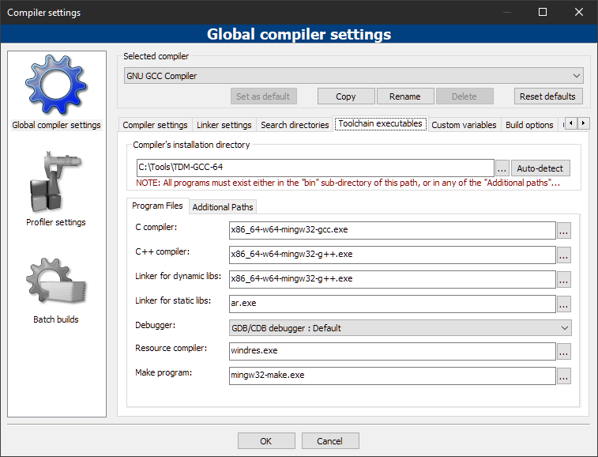
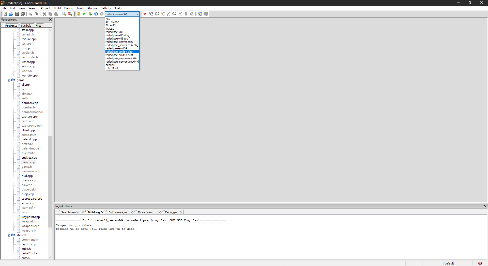
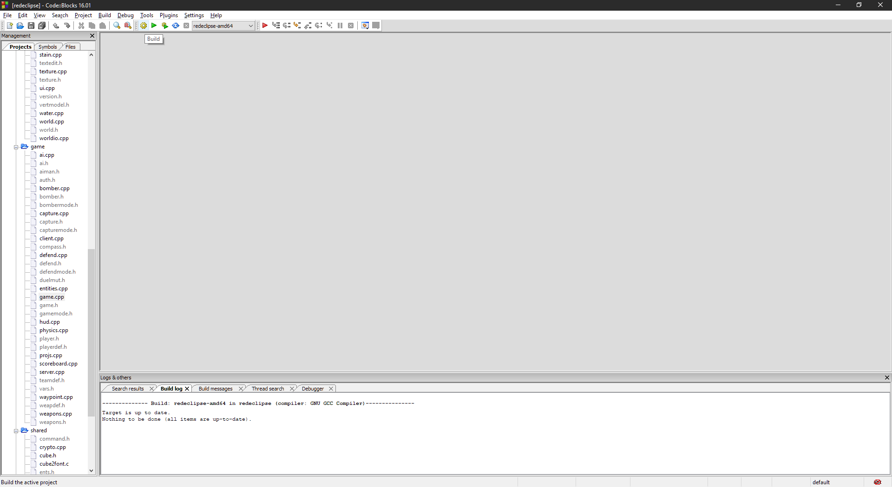
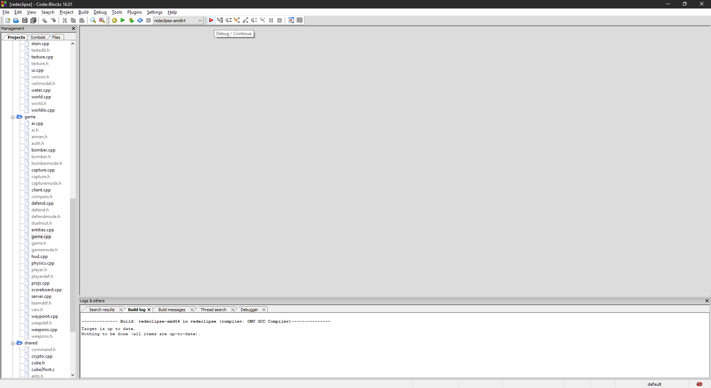
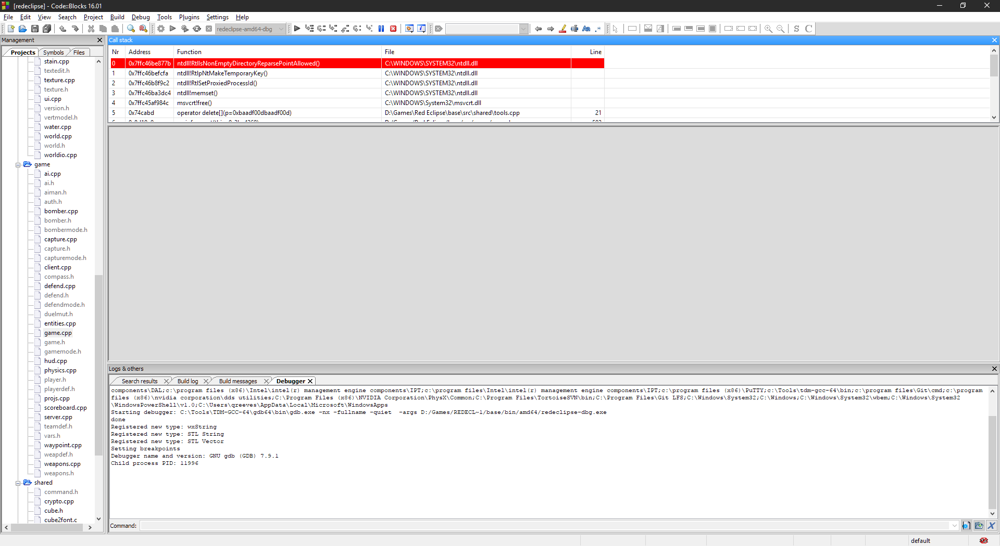

* TOC
{:toc}
To submit a bug report that concerns a crash to the Red Eclipse Team, it is helpful to have a backtrace.

## Windows (64 bit)

You must download and install Code::Blocks for easiest building on Windows.

### Setting up Code::Blocks

- Install TDM-GCC-64
- You may need to set the Code::Blocks compiler to TDM-GCC-64, open Code::Blocks and go to `Settings -> Compiler -> Global Compiler Settings -> Toolchain Executables`. Paths may need changed depending on where you installed it.
<a href="images/debug/Win64dbg06.png" target="_blank"></a>

### Compiling Red Eclipse

- Open redeclipse.cbp in Code::Blocks as a project.
- Select the debug build (redeclipse-amd64-dbg)
<a href="images/debug/Win64dbg01.png" target="_blank"></a>
- Press the Build button.
<a href="images/debug/Win64dbg02.png" target="_blank"></a>

### Running Red Eclipse and Retrieving the Backtrace

- Press the Debug/Continue button.
<a href="images/debug/Win64dbg03.png" target="_blank"></a>
- Red Eclipse will now start, attempt to crash it.
- Once crashed, you will see the debugger near the bottom of the screen with a Command input. Write `bt full` in that command input and press enter.
<a href="images/debug/Win64dbg04.png" target="_blank"></a>
- This will produce a backtrace, copy and paste this to an accessible place such as a crash report on the Red Eclipse forum or a paste service to be linked on [IRC](IRC).

## Linux

On Linux-based systems, you can use GDB to get a backtrace:

First you must compile with debug symbols:

```
make -Csrc clean && CXXFLAGS=-ggdb3 make -Csrc install
```

Then run with GDB:
```
gdb src/redeclipse_linux
```
Inside GDB, to start Red Eclipse:
```
run
```
Once Red Eclipse has crashed, GDB will catch this and present a prompt. At this prompt run:
```
bt full
```
This will produce a backtrace, copy and paste this to an accessible place such as a crash report on the Red Eclipse forum or a paste service to be linked on [IRC](IRC). 
