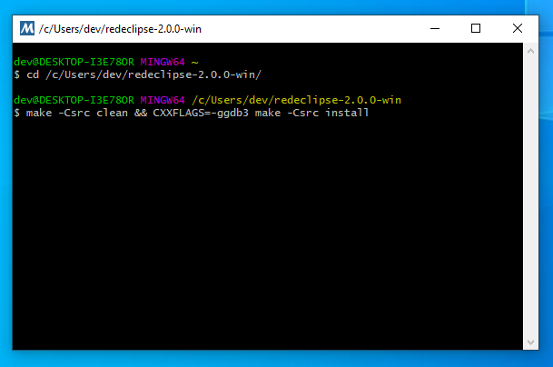
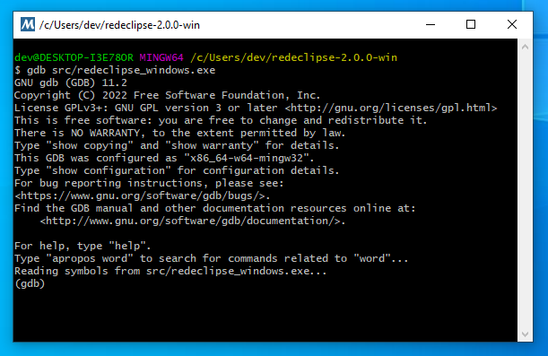

* TOC
{:toc}
To submit a bug report that concerns a crash to the Red Eclipse Team, it is helpful to have a backtrace.

## Windows (64 bit)

You must download and install MSYS2 for easiest building on Windows.

### Setting up MSYS2

- Install MSYS2 from [https://www.msys2.org/](https://www.msys2.org/) and follow the instructions on that page
- Then launch **MSYS2 MinGW x64** from the start menu

### Compiling Red Eclipse

In the MSYS2 prompt, change directory to the location of Red Eclipse:
```
cd /c/Users/qreev/Documents/redeclipse
```
*(note: that MSYS2 is using "/" as the root directory, so that `C:\Users\qreev\Documents\redeclipse` would be written as `/c/Users/qreev/Documents/redeclipse`)*

First you must compile with debug symbols:
```
make -Csrc clean && CXXFLAGS=-ggdb3 make -Csrc install
```

<a href="images/debug/win_dbg1.png" target="_blank"></a>

Then run with GDB:
```
gdb src/redeclipse_windows.exe
```

<a href="images/debug/win_dbg2.png" target="_blank"></a>


Inside GDB, to start Red Eclipse, type:
```
run
```

Now attempt to reproduce the problem in game. Once Red Eclipse has crashed, GDB will catch this and present a prompt. At this prompt run:
```
bt full
```
This will produce a backtrace, copy and paste this to an accessible place such as a crash report on the Red Eclipse [Github Issues page](https://github.com/redeclipse/base/issues) or paste to the Red Eclipse [Discord](https://discord.com/invite/RPDmG5Z).


## Linux

On Linux-based systems, you can use GDB to get a backtrace:

First you must compile with debug symbols:

```
make -Csrc clean && CXXFLAGS=-ggdb3 make -Csrc install
```

Then run with GDB:
```
gdb src/redeclipse_linux
```
Inside GDB, to start Red Eclipse, type:
```
run
```
Now attempt to reproduce the problem in game. Once Red Eclipse has crashed, GDB will catch this and present a prompt. At this prompt run:
```
bt full
```
This will produce a backtrace, copy and paste this to an accessible place such as a crash report on the Red Eclipse [Github Issues page](https://github.com/redeclipse/base/issues) or paste to the Red Eclipse [Discord](https://discord.com/invite/RPDmG5Z).
