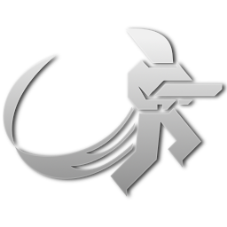
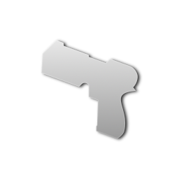

* TOC
{:toc}
For those mutators specific to certain game modes, see the corresponding [mode pages](Modes-and-Mutators).

## FFA

- The most important thing to remember in Free-for-All: no target or enemy is safe from your fire! Don't hesitate to let loose in a frenzy at everyone and everything you see.
- Unlike team modes, explosive items cannot possibly count against you in Free-for-All unless you hit yourself. Grab every single grenade, mine & rocket you can hold then use them quickly and strategically.
- The Free-for-All mutator is often used in Race matches and forced in Edit mode.
- Any modes, mutators or combinations thereof with team objectives are incompatible with the Free-for-All mutator.
- Free-for-All can be used in Bomber-Ball matches if the Hold mutator is selected.
- Player coloring is different when the Free-for-All mutator is selected, and these settings can be controlled from the profile menu.

## Coop

- Note that there are separate vars for the balancing and skill range of bots in Co-op games. For an extra challenge, raise `/botskill` or `/botlimit`.
- In addition to A.I. skill, each weapon has a skew variable according to it's name that affects A.I. accuracy. For example, `/shotgunaiskew1`.
- Bots may be formidable opponents in Deathmatch games, but the A.I. has problems keeping up with players in more complex modes.
- To make a Co-op match more interesting, enable the Survivor and/or Vampire Mutators.
- Bots are programmed in a specific way and some of their actions can be predictable, so use this to your advantage.
- A.I. movement is assisted by a large collection of invisible points on the map called waypoints. Bots use these waypoints to calculate their fastest or least dangerous routes.

## Instagib

- Instagib matches are very fast-paced and hectic. While it may be easier to frag opponents, you are also fragged much more often yourself (the respawn time is shortened to reflect this).
- Rifle shots normally inflict splash damage, but this is disabled in Instagib games. So aim carefully!
- Grenades are also weakened - explosion radius is half the normal. Time your bombs!
- Remember, you can also attack opponents with melee kicks or certain other parkour moves in Instagib.
- Instagib is a very effective way to build your skill quickly with the Rifle's primary and secondary fire.
- To mix up an Instagib match, change the spawn weapon using `/instaweapon`.

## Medieval

- Grenades still spawn in the Medieval mutator, but mines are disabled by default.
- When attacking with the sword, impulse is almost as valuable as health. Spend your limited meter wisely, and remember to crouch to regenerate impulse faster.
- As with any weapon, always aim for the head! A headshot is sure to inflict bleed damage and drain opponents' health quicker.
- Medieval is a very effective way to build your skill quickly with the Sword's primary and secondary attacks.
- When the Medieval mutator is voted with Instagib, it only takes one swipe to frag opponents!

## Kaboom

- On some maps, there are additional rockets that spawn only in Kaboom games.
- Kaboom matches on small and complicated maps can be very... explosive. Evasion is almost as important as your offense.
- Remember, you spawn with both grenades and mines! Switch between them often to maximize your combat effectiveness.
- Make use of the unique functionality of grenade and mine primary and secondary attacks. Learn their differences to boost your advantage.
- In Kaboom (especially Free-for-All), mines often cover lower surfaces. So, traverse using Wall Runs and Wall Jumps whenever you can.

## Duel

- For obvious reasons, the rocket does not spawn in the Duel mutator (though other explosives do by default).
- Duel matches are often very frustrating between two players of different skill level. However, there is much to be learned from other players when spectating! Don't let the length of a queue distract you from learning new strategy.
- Duels are typically carried out on smaller and more compact maps, which is why there is a separate map list for this mutator.
- Without health regeneration, every action toward opponents becomes a calculated risk. Be as cautious in your offense as your defense.
- If desired, game music can be silenced using `/musicvol 0`. This will allow you to hear your opponent's footsteps and parkour moves!
- For an extra challenge, combine Duel with the Hard mutator for disabled radar.

## Survivor

- With no health regeneration, it is wiser to form a more cautious strategy than rushing into the heat of battle. Remeber, the only goal in this mutator is survival to the end.
- Explosives and their recursive damage statuses are more dangerous than normal. Be on your guard for hidden mines and opponents wielding a grenade. By default the rocket does not spawn in Survivor.
- Snipers that camp behind cover are commonplace in Survivor. If possible, avoid routes with wide open spaces and stick to corridors or plenty of cover.
- Players that have just joined a Survivor match must wait in queue until the next round starts to spawn.
- In Free-for-All Survivor Deathmatch, taking cover in a hidden spot until the worst of the combat is over is not a poor strategy!

## Classic

- In addition to weapon spawn points, fragged players drop their weapons upon death to be picked up by other players (but will disappear after a few seconds).
- Once a weapon has spawned, it will not respawn until it has been dropped and disappears or is lost in a pit.
- Learn the locations of your favorite weapon spawns per map, for better control of your combat and to put yourself at a greater advantage.
- Playing Classic is an excellent way to develop your skill with every weapon and learn the effectiveness of new strategies, as well as determine what loadout you are most comfortable with when the choice is presented to you.
- Fun Fact: Classic used to be the default playstyle for Deathmatch mode, while choice of weapon loadout was a mutator called Arena.

## Onslaught

- The addition of drones and turrets is intended to complicate the action and add to the chaos of a match. It is especially overwhelming in Defend-and-Control, where you must hold the same spot for a set period of time.
- On some maps there are enemy gun turrets than spawn only when the Onslaught mutator is enabled.
- More targets to hit make weapons with a wider spread more rewarding to use. Now, where is that rocket?
- When critically wounded during Onslaught, keep your distance from annoying drones to avoid being picked off quickly.
- Drone enemies travel at a slower default speed than normal bots, and utilize only 1 weapon (with added A.I. stupidity).

## Freestyle

- The Freestyle mutator also disables the impulse count rule, so you can keep on performing parkour moves to your heart's content.
- Especially on larger maps with wide open areas, the Freesyle mutator can lead to chaotic and very fast-paced gameplay.
- There are no limits to creativity with parkour during Freestyle. Explore new shortcuts, reach new heights and cheat death!
- One very effective strategy for quick movement during Freestyle is a continuous chain of Impulse Slides.
- Freestyle is a sword wielder's heavensend. With no need to stop offense to regenerate impulse, all players should beware the mighty sword.

## Vampire

- Because of the leech effect when players exchange health, combat during vampire matches can last for quite a while (especially when Survivor or Duel is also selected).
- Even with a large amount of health, a few direct hits will bring you back to reality quickly. Don't let your guard down.
- When the Resize mutator is also selected, players can grow larger than their normal size, proportional to the health increase.
- Obviously the most effective strategy in this mode is to deal as much damage as possible to as many opponents as possible. The Flamer and Zapper are excellent ways to cause residual damage which will conversely add to your health.
- During Vampire Capture-the-Flag it is advantageous to target a few weaker opponents to build up your health before making a run for the flag.

## Resize

- When combined with the Instagib mutator, you become larger every time you kill an enemy in Resize (until you die and return to normal size).
- A small target may be harder to hit, but also moves at a slower pace. Cover more width using a weapon with a larger spread.
- In a way, being far smaller or far larger than the default sized player has disadvantages. Aim for a delicate balance to negate the effect of this mutator.
- You may grow so large in Resize as to find yourself unable to fit in certain areas of maps. A little of your own weapon flak will shave off some of that extra mass.
- When smaller in size than your opponent, try to remain right beneath their field of view by jumping toward their feet.

## Hard

- As the name implies, the purpose of this mutator is to provide an added layer of difficulty to a match through handicaps.
- As with Survivor or Duel, there is no health regeneration in Hard matches. Tread carefully and make your shots count.
- No matter what radar style you have chosen, it is completely disabled during a Hard match. The element of suprise rests in the hands of every player.
- Remember, not only have you lost track of players and teammates, you also won't see explosives (including the rocket) spawn on your radar. Check their spawn points frequently.
- For a truly brutal Red Eclipse, try a Free-for-All Freestyle Onslaught Hard Deathmatch on a large map.

## Basic

- If you want a match without grenades, mines and rockets, try the basic mutator.
- Forget about map control: Focus on your enemies and team objective!
- For a showdown with pistols and parkour only, combine the classic and basic mutators.
