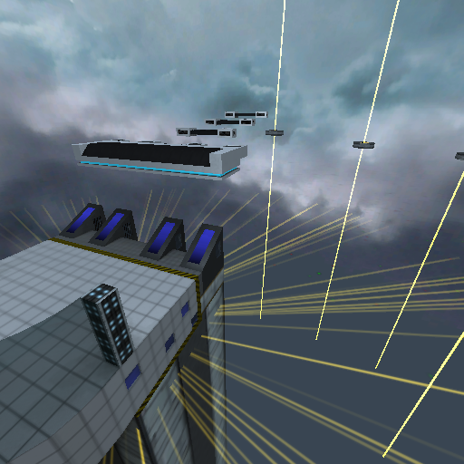
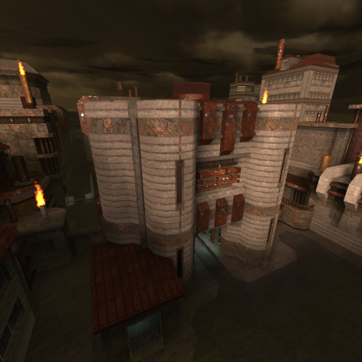
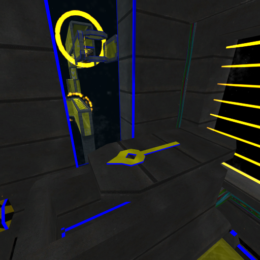
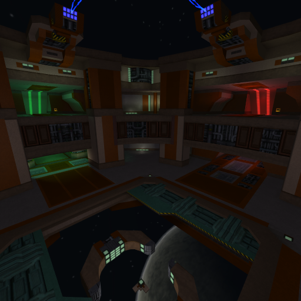
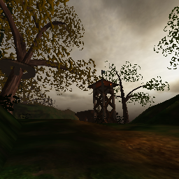
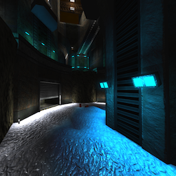
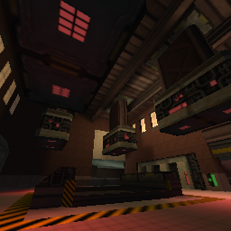
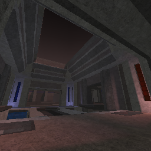

* TOC
{:toc}
## Maps updated to 2.0 (Tesseract)

[//]: # (HTML is easier to maintain as markdown when applying changes)
<table>
    <tr>
        <td>
            

            
Castle

        </td>
        <td>
            

            
Dutility

        </td>
        <td>
            

            
<a href="maps/Fatal-Error">Error</a>

        </td>
        <td>
            

            
Polaris

        </td>
    </tr>
</table>

## Main maps

[//]: # (HTML is easier to maintain as markdown when applying changes)
<table>
    <tr>
        <td>
            

            
Abuse

        </td>
        <td>
            

            
Battlefield

        </td>
        <td>
            

            
Bloodlust

        </td>
        <td>
            

            
Cargo

        </td>
        <td>
            

            
Castle

        </td>
    </tr>
    <tr>
        <td>
            

            
Center

        </td>
        <td>
            

            
Conflict

        </td>
        <td>
            

            
Darkness

        </td>
        <td>
            

            
Deathtrap

        </td>
        <td>
            

            
Deli

        </td>
    </tr>
    <tr>
        <td>
            

            
Depot

        </td>
        <td>
            

            
Dropzone

        </td>
        <td>
            

            
Dutility

        </td>
        <td>
            

            
Echo

        </td>
        <td>
            

            
Enyo

        </td>
    </tr>
    <tr>
        <td>
            

            
<a href="maps/Fatal-Error">Error</a> 

        </td>
        <td>
            

            
Ghost

        </td>
        <td>
            

            
Keystone2k

        </td>
        <td>
            

            
Livefire

        </td>
        <td>
            

            
Longestyard

        </td>
    </tr>
    <tr>
        <td>
            

            
Nova

        </td>
        <td>
            

            
Panic

        </td>
        <td>
            

            
Polaris

        </td>
        <td>
            

            
Suspended

        </td>
        <td>
            

            
Tribal

        </td>
    </tr>
    <tr>
        <td>
            

            
Ubik

        </td>
        <td>
            

            
Wet

        </td>
    </tr>
</table>

## Race maps
[//]: # (HTML is easier to maintain as markdown when applying changes)
<table>
    <tr>
        <td>
            

            
<a href="maps/Absorption">Absorption</a>

        </td>
        <td>
            

            
Cyanide

        </td>
        <td>
            

            
Decomposition

        </td>
        <td>
            

            
Escape

        </td>
        <td>
            

            
Hinder

        </td>
    </tr>
    <tr>
        <td>
            

            
Neodrive

        </td>
        <td>
            

            
Purge

        </td>
        <td>
            

            
Relax

        </td>
        <td>
            

            
Testchamber

        </td>
        <td>
            

            
Wardepot

        </td>
    </tr>
</table>

## Gladiator maps
[//]: # (HTML is easier to maintain as markdown when applying changes)
<table>
    <tr>
        <td>
            

            
Abuse

        </td>
        <td>
            

            
Deathtrap

        </td>
        <td>
            

            
<b>Disco</b>

        </td>
        <td>
            

            
Dutility

        </td>
        <td>
            

            
<b>Eternal</b>

        </td>
    </tr>
    <tr>
        <td>
            

            
Purge

        </td>
        <td>
            

            
<b>Singularity</b>

        </td>
        <td>
            

            
<b>Torus</b>

        </td>
    </tr>
</table>

**Note:** Bold maps are gladiator-only; other maps are adapted from other game modes.

## Bonus maps
Bonus content is available at [https://github.com/redeclipse/bonus](https://github.com/redeclipse/bonus).

[//]: # (HTML is easier to maintain as markdown when applying changes)
<table>
    <tr>
        <td>
            

            
Affluence

        </td>
        <td>
            

            
Ares

        </td>
        <td>
            

            
Bath

        </td>
        <td>
            

            
Biolytic

        </td>
        <td>
            

            
Canyon

        </td>
    </tr>
    <tr>
        <td>
            

            
Cutec

        </td>
        <td>
            

            
Deadsimple

        </td>
        <td>
            

            
Erosion

        </td>
        <td>
            

            
Futuresport

        </td>
        <td>
            

            
Institute

        </td>
    </tr>
    <tr>
        <td>
            

            
Mist

        </td>
        <td>
            

            
Oneiroi

        </td>
        <td>
            

            
Spacetech

        </td>
        <td>
            

            
Stone

        </td>
        <td>
            

            
Tonatiuh

        </td>
    </tr>
    <tr>
        <td>
            

            
Tower

        </td>
        <td>
            

            
Vault

        </td>
        <td>
            

            
Venus

        </td>
    </tr>
</table>

## Former maps
### Removed in 2.0
[//]: # (HTML is easier to maintain as markdown when applying changes)
<table>
    <tr>
        <td>
            

            
<b>Affluence</b>

        </td>
        <td>
            

            
<b>Ares</b>

        </td>
        <td>
            

            
<b>Bath</b>

        </td>
        <td>
            

            
<b>Biolytic</b>

        </td>
        <td>
            

            
Campgrounds

        </td>
    </tr>
    <tr>
        <td>
            

            
<b>Canyon</b>

        </td>
        <td>
            

            
<b>Cutec</b>

        </td>
        <td>
            

            
<b>Deadsimple</b>

        </td>
        <td>
            

            
Decay

        </td>
        <td>
            

            
Discontinuity

        </td>
    </tr>
    <tr>
        <td>
            

            
<b>Erosion</b>

        </td>
        <td>
            

            
<b>Futuresport</b>

        </td>
        <td>
            

            
<b>Institute</b>

        </td>
        <td>
            

            
<b>Mist</b>

        </td>
        <td>
            

            
Octavus

        </td>
    </tr>
    <tr>
        <td>
            

            
<b>Oneiroi</b>

        </td>
        <td>
            

            
Processing

        </td>
        <td>
            

            
Pumpstation

        </td>
        <td>
            

            
<b>Spacetech</b>

        </td>
        <td>
            

            
Steelrat

        </td>
    </tr>
    <tr>
        <td>
            

            
<b>Stone</b>

        </td>
        <td>
            

            
<b>Tonatiuh</b>

        </td>
        <td>
            

            
<b>Tower</b>

        </td>
        <td>
            

            
<b>Vault</b>

        </td>
        <td>
            

            
<b>Venus</b>

        </td>
    </tr>
    <tr>
        <td>
            

            
Vorticity

        </td>
    </tr>
</table>

**Note:** Bold maps are now available as bonus content.

### Removed in 1.5.8
[//]: # (HTML is easier to maintain as markdown when applying changes)
<table>
    <tr>
        <td>
            

            
<a href="maps/Canals">Canals</a>

        </td>
        <td>
            

            
<a href="maps/Colony">Colony</a>

        </td>
        <td>
            

            
<a href="maps/Rooftop">Rooftop</a>

        </td>
        <td>
            

            
Train

        </td>
    </tr>
</table>

### Removed in 1.5.6
[//]: # (HTML is easier to maintain as markdown when applying changes)
<table>
    <tr>
        <td>
            

            
<a href="maps/Linear">Linear</a>

        </td>
        <td>
            

            
<a href="maps/Fortitude">Fortitude</a>

        </td>
    </tr>
</table>

### Removed in 1.5.4
[//]: # (HTML is easier to maintain as markdown when applying changes)
<table>
    <tr>
        <td>
            

            
<a href="maps/Condensation">Condensation</a>

        </td>
        <td>
            

            
<a href="maps/Convolution">Convolution</a>

        </td>
    </tr>
</table>

### Removed in 1.5.0
[//]: # (HTML is easier to maintain as markdown when applying changes)
<table>
    <tr>
        <td>
            

            
<a href="maps/Amplification">Amplification</a>

        </td>
        <td>
            

            
<a href="maps/Forge">Forge</a>

        </td>
        <td>
            

            
<a href="maps/Foundation">Foundation</a>

        </td>
        <td>
            

            
<a href="maps/Fourplex">Fourplex</a>

        </td>
        <td>
            

            
<a href="maps/Hawk">Hawk</a>

        </td>
    </tr>
    <tr>
        <td>
            

            
<a href="maps/Starlibido">Starlibido</a>

        </td>
        <td>
            

            
<a href="maps/Warp">Warp</a>

        </td>
    </tr>
</table>

### Removed in 1.4.0
[//]: # (HTML is easier to maintain as markdown when applying changes)
<table>
    <tr>
        <td>
            

            
<a href="maps/Blink">Blink</a>

        </td>
        <td>
            

            
<a href="maps/Dawn">Dawn</a>

        </td>
        <td>
            

            
<a href="maps/Facility">Facility</a>

        </td>
        <td>
            

            
<a href="maps/Industrial">Industrial</a>

        </td>
        <td>
            

            
<a href="maps/Isolation">Isolation</a>

        </td>
    </tr>
    <tr>
        <td>
            

            
<a href="maps/Lab">Lab</a>

        </td>
        <td>
            

            
<a href="maps/Tranquility">Tranquility</a>

        </td>
    </tr>
</table>

### Removed in 1.3.0
[//]: # (HTML is easier to maintain as markdown when applying changes)
<table>
    <tr>
        <td>
            

            
<a href="maps/Alpha-Campaign">Alpha Campaign</a>

        </td>
    </tr>
</table>
