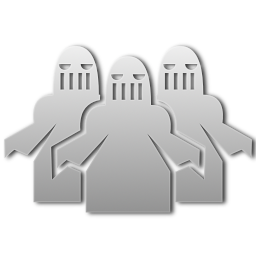
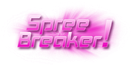
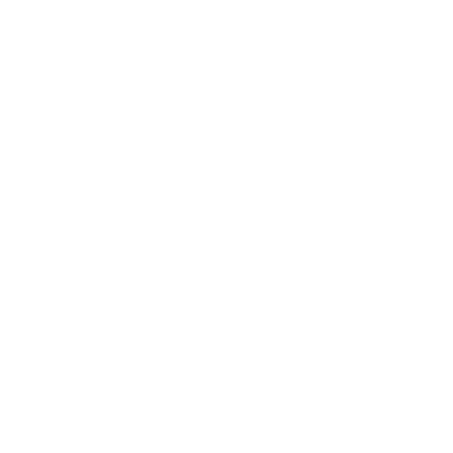
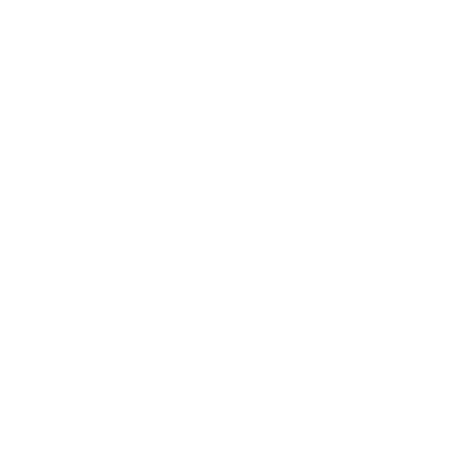

* TOC
{:toc}
Scoring in Red Eclipse is handled using a very intricate Deathmatch Scoring System, with normal point gain and loss as well as bonus points attainable through combo streaks or sprees. Scoring in other game modes is also slightly different. Here team scores are purely objective based, while the scoring system described here still applies to the scores of individual players.

## Point-gain
### Frags and assists

The core objective of the entire game, land the killing shot on an enemy to earn a frag and 3 points. If you did not kill an opponent, but chipped in with a hit over the previous 5.0 seconds before death, your name is mentioned in the obituary line for an assist, and you receive one point. Multiple players can receive assists on the same kill, and in a team game this can result in multiple points from assists for the same team. Also note that it doesn't only count damage-dealing attacks, but some weapons that result in near-misses will still give off shockwaves that push players around, and one of those, no matter how slight, still qualifies you to receive an assist. This leads to the somewhat odd result that players can still earn assists even in Instagib mode.

### Headshots

If your killing shot hits the head, you get a 1-point bonus for this. Unique among all bonuses, Head Shot is not listed in the obituary line, only as a visual indicator on the screen of the player who scored it (or a pop-up shown above their head, from the other players' perspectives). You can also get a Head Shot message on a team kill, but in this case the message results in no additional points, positive or negative.

### First blood

This bonus can only be awarded once in a match, providing a 1-point bonus to the first human player who scores a frag. Frags made by bot players are currently not taken into account for handing out First Blood, because bots (who don't have to load the graphical textures and models for a map) often have a several-second head start on the humans in getting set up.

## Point-penalties
### Team kills

In team games, you have teammates for a reason, so don't kill them! Doing so brings a harsh penalty: -6 points are lost for each team kill. There is only one exception: No points are lost for kills attributed to residual damage (bleeding, electric shock, or burn). Avoid team kills at all costs, as too many will get you automatically kicked and banned from the server!

### Suicide
If you hit yourself with your own weapon and run out of health (this includes exploding yourself with grenades or hitting your own mines), this counts as a team kill and is subject to the above scoring. However, there are other ways to die both accidental and on purpose: jumping into an abyss or off the edge of the map, a lava pit or other map hazard (causing you to collide with invisible death material). Also, you can press K at any time to immediately commit suicide. None of these options are desirable, bringing a penalty of -3 (pressing K while holding a grenade brings a penalty of -6).

### Enemies

If the Onslaught mutator is selected, and if the chosen map provides for it by placing the appropriate spawn points, a neutral army of grunts, drones, and/or turrets will swarm the arena. These forces (collectively and internally known as 'enemies') do not have a place on the scoreboard, but if one of them administers a frag, the unfortunate victim loses 3 points from their score. Enemies can also be listed for assists, but these are totally inconsequential; there is no further penalty regardless of how many enemies chip in with assists. Killing an enemy adds to your frag count, but it isn't announced in the obituary feed, and it only provides one point instead of the usual 3. If the kill is a head shot (not applicable against turrets), you can earn a second point from that, but otherwise kills against enemies are not taken into account for any other bonuses such as Double Kill or Carnage.

## Combo-streaks
  

Killing 2, 3 or even 4 players in a time window of 5.0 seconds is awarded with a double, triple or multi kill bonus for a total of 1, 2 or 3 bonus points, respectively. Though there are no bonus points awarded for a combination of more than 4 kills in a row, these streak bonuses can be earned multiple times.

### Killing-sprees
   

If you manage to get 5 frags in a row (regardless of how long they take) without dying or committing any team kills in between, this will give a message saying that it was 'in total carnage', and you receive a 1-point bonus. Further spree awards for higher multiples of 5 frags in a row are slaugher, massacre and bloodbath. Every killing spree bonus can only be earned once per player per match. For example, once you get a carnage bonus, you won't get any more bonuses for further 5-streaks in this match.

### Spree breaker

If you frag an opponent who has an active killing spree, you will earn the Spree Breaker bonus and 1 extra point. Note that it's possible for the player on a killing spree to get team-killed, commit a team-kill, or commit suicide, in which case their spree will come to an end without allowing anyone to score the Spree Breaker.

## Miscellaneous
### Dominating
 

If you frag the same opponent 5 times, possibly interspersed with any number of kills on other players, or even with your own deaths (as long as none of them were caused by that opponent), the fifth head-to-head kill in a row will give you Dominating bonus of one point. You can have active Dominating streaks on any number of other opponents, getting a point for each one, but there are no further bonuses for any consecutive head-to-head kills beyond 5. Also, if you have a Dominating streak against someone, that player will be able to see which direction you're in on their radar, no matter how far away you are. You will not receive the same luxury against them, so be careful! In addition, the dominated player will see 'Dominated' icon over your head and near your nickname in the stats screen to , while 'Dominating' icon will appear in the same places of the dominated player to you.

### Revenge

If an opponent has a Dominating streak against you, track them down and frag them once to earn Revenge and one bonus point, which also causes you to lose your constant sight of them on the radar. After a streak has been broken with Revenge, it's possible to start up a new streak against the same player and score Dominating again. Or maybe the vengeful player will find their fortunes have turned around and they can start up a Dominating streak of their own.

## Non-deathmatch
In objective based team games, frags and bonus elements of the Deathmatch Scoring System have no impact on the team scores. However, this scoring system is still applied to individual player scores, while certain actions related to the team objective give additional bonus points.

### Duel and survivor
 

If either one of these modes are selected, regardless of game type, players' scores are replaced by a different system that tracks the number of rounds they've scored in, and thus their contribution to the team score if it's a team game. In a survivor deathmatch, the winning team only receives 1 point per round regardless of how many players are still alive, but each surviving player at the end gets a point to their own credit. The one exception is that multi-survivor Capture the Flag offers the unique possibility of earning up to 3 points per round (by capturing all 3 other flags simultaneously).

### Capture-the-flag

- Fragging an opponent who holds your flag: 6 points (including the awarded for the frag).
- Picking up an opponent's flag: 3 points.
- Returning your flag to your base: 5 points. If the Quick Mutator is active, you can score this simply by touching the flag; note that there is no bonus for picking up your own flag.
- Capturing an opponent's flag: 5 points.
- Killing a team mate who carries a flag: -12 points (including the team kill penalty).

### Defend-and-control

- Fragging an opponent who is defending one of their control points: 6 points (including the award for the frag).
- Standing near a control point of your own color: 1 point every 2.5 seconds, the same rate at which it adds to your team score. In non-King games, you can leave a control point and it will continue to provide points for your team as long as it remains your color, but it will no longer give points to your own score until you come back into its buff zone.
- Killing a team mate that defends a secured control point: -12 points.

### Bomber-ball

- Fragging an opponent who holds the ball: 6 points (including the award for the frag).
- Picking up the ball: 3 points.
- Scoring a goal: 5 points.
- Killing a team mate who holds the ball: -12 points (including the team kill penalty).
- Scoring an own goal: -5 points, and -1 point to the team score. Note that simply carrying the ball over your base does not count as an own goal; you have to throw the ball and let it fly or bounce into your goal to earn this dubious achievement. It is impossible to score an own goal if Touchdown is selected.
- In the Hold mutator, deathmatch scores are not used. Instead, each player's listed score will simply be their contribution to the team score, if it's a team game. Players score 1 point for each second they hold onto the ball, with a penalty of -10 points for holding onto the ball too long and having the timer run out. No other actions affect the points in the Hold mutator.

### Race

The scoring system in race games is usually limited to the lap count of each player and team - or the fastest lap time when the Timed mutator is active. Even though deathmatch scoring awards can be earned in Gauntlet Trial, they have no effect on a players score. 
