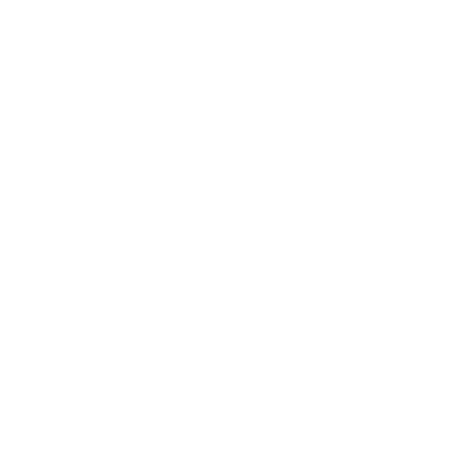
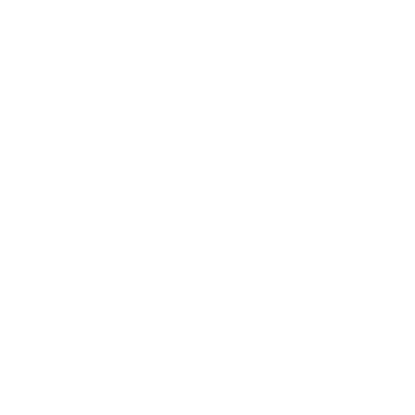

* TOC
{:toc}
## Buffs

A buff is a strong, temporary status enhancement that players can receive in capture, bomber or defend games. The buff implies.

- *+25%* attack (outgoing damage is multiplied by 1.25)
- *+25%* defense (incoming damage is divided by 1.25)
- *+50%* health (regenerates up to 150 hp)
- *+40%* faster regeneration (7 hp per second)

Players get buffed when **defending**

- a secured control point in defend games
- their base in bomber games
- the flag in their team base or
- a team mate who carries their flag
- Note: The flag carrier is not buffed and
- dropped flags have no buffing power

## Ailments
Some weapons induce status ailments that inflict some damage over time and last for about five seconds. Useful to delay enemy health recovery. Multiple effects can be stacked.

### Shock

Slows down movement greatly. Deals 2 damage per second for 5.5 seconds. Caused by the zapper, mines and specific hurt residuals.

### Burn

Deals 3 damage per second for 5.5 seconds. Can be negated with the secondary fire of the flamer or by entering water (as long as the burnt body part is submerged). Caused by grenades, rockets, flamer and specific hurt residuals.

### Bleed

Deals 3 damage per second for 5.5 seconds. Caused by the secondary fire of the shotgun, sword and specific hurt residuals. 
