* TOC
{:toc}
Red Eclipse features 5 playable game modes which can be further customised through mutators. Along with the cooperative map editor and a demo viewer to playback previously recorded matches.

### Basic Gameplay
Default gameplay consists of two teams placed within the level which compete against each other to score the most points within the set time limit.

#### Weapons

In most games all players are equipped with a pistol and two of their favorite loadout weapons. Furthermore, explosive weapons can be collected in the arena, such as grenades and mines, to bolster their offensive abilities. See the [main article](Weapons-Guide) on weapons here.

#### Parkour

Red Eclipse features a parkour system, that allows you to navigate maps in many different ways.
See the [main article](Parkour-Guide) on parkour here.

#### Teams

|Icon                                                 |Team      |Default Colour|
|-----------------------------------------------------|----------|--------------|
||Team Alpha|Blue          |
||Team Omega|Red           |

#### Team swapping

In some gamemodes where teams are present, the server may randomly swap some players onto the opposing team in the event the teams are unbalanced.

#### Affinities

An affinity is an object in game which can be collected to score points, such as a flag or a ball.
In game modes [**Capture the Flag**](Capture-the-Flag) and ~~[**Bomber Ball**](Bomber-ball)~~, you can throw the affinity to your teammates by pressing [F].

#### Friendly fire

By default friendly fire is enabled. Make sure not to injure your own teammates otherwise you will lose points for both yourself and your team. If you deal too much damage to your own teammates you will be warned, before eventually being kicked from the server.

#### Half time

Some maps will have a layout that is not perfectly symmetrical where one team may have a slight advantage. To counteract this for balance, the server may automatically swap the teams spawn points when the time limit reaches halftime.

### Game Modes

|Icon                                                   |Mode                  |Description|
|-------------------------------------------------------|----------------------|------------------------------------------------------|
| 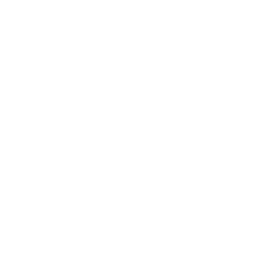      |**Demo**              |Play back previously recorded games                   |
| 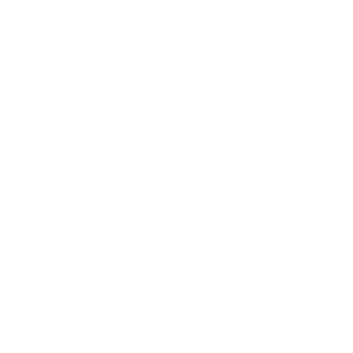   |**Editing**           |Create and edit existing maps                         |
| 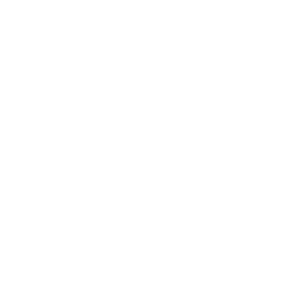|**Deathmatch**        |Shoot to kill and increase score by fragging          |
|    |[**Capture the Flag**](Capture-the-Flag)  |Take the enemy flag and return it to the base to score|
|     |~~[**Defend and Control**](Bomber-ball)~~|Defend control points to score                        |
|     |**Bomber Ball**       |Carry the bomb into the enemy goal to score           |
|       |**Race**              |Compete for the fastest time completing a lap         |

### Mutators
Gameplay can be further customised by enabling mutators to create some unique game mode combinations.

|Icon                                                 |Mutator  |Description|
|-----------------------------------------------------|---------|--------------------------------------------------|
|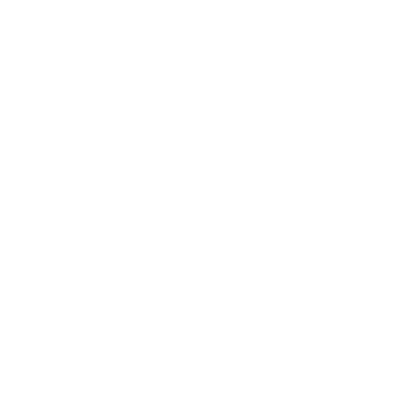      |FFA      |Every player for themselves                       |
|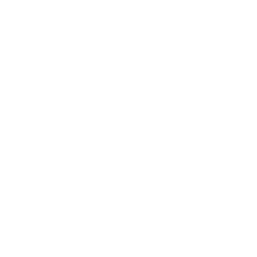     |Coop     |Players versus drones                             |
|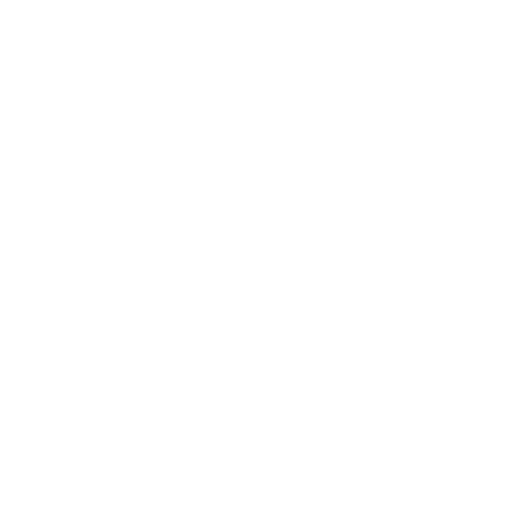 |Instagib |One hit kills instantly                           |
|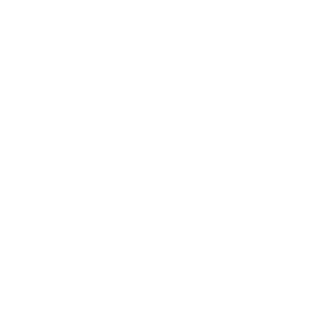 |Medieval |Players spawn only with swords                    |
|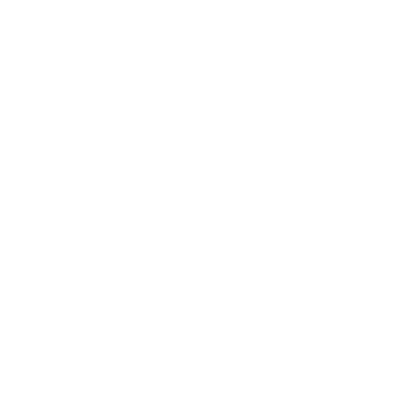   |Kaboom   |Players spawn with explosives only                |
|     |Duel     |One on one battles to determine the winner        |
| |Survivor |Players battle to determine the winner            |
|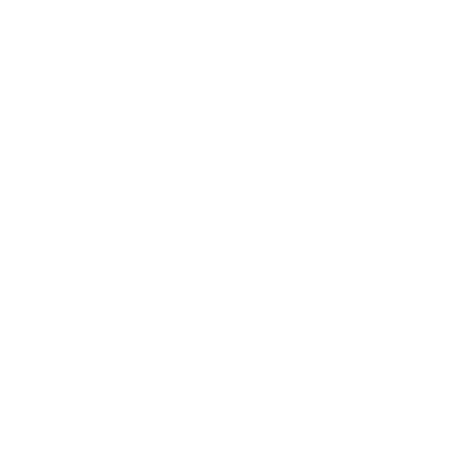  |Classic  |Weapons must be collected from spawns in the arena|
||Onslaught|Waves of enemies fill the battle arena            |
|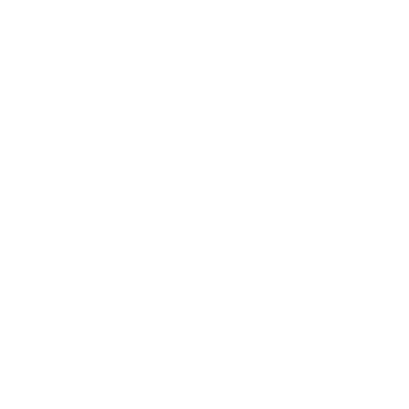  |Vampire  |Deal damage to regenerate health                  |
|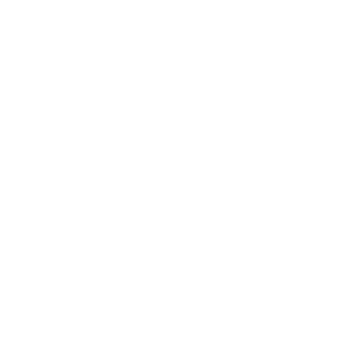   |Resize   |Players change size depending on their health     |
|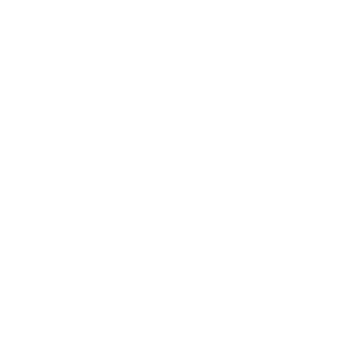     |Hard     |Radar and health regeneration is disabled         |
|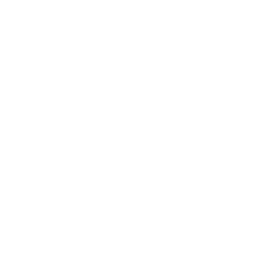    |Arena    |Players are able to carry all weapons at once     |

An example of how mutators work to change the gameplay:

Selecting the game mode, **Deathmatch**, along with the following mutators:

* FFA
* Instagib
* Medieval
* Hard

This will create a game mode where players are not on teams, they only spawn with the sword, one hit kills instantly and there is no radar present.

The above example will be abbreviated as **FF-In-Me-Ha-Deathmatch** for the active game mode being played.

#### Game mode specific mutators
Additional mutators which can only be enabled in specific game modes.

|Icon                                                      |Mode              |Mutator   |Description|
|----------------------------------------------------------|------------------|----------|------------------------------------------------------------|
|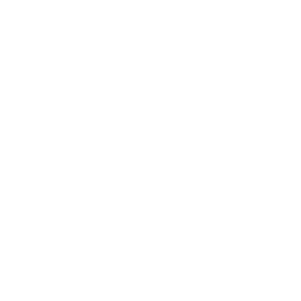     |Deathmatch        |Gladiator |Fight in a confined area with increased pushback from damage|
|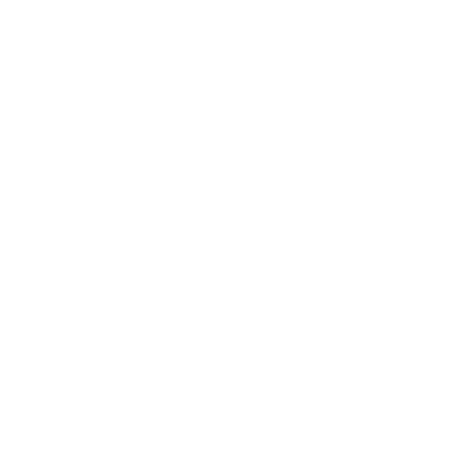     |Deathmatch        |Old School|Every frag only gives you a single point, like the old days |
|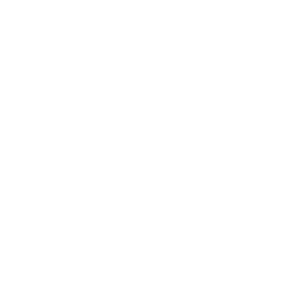  |Capture the Flag  |Quick     |Dropped flags instantly return to base                      |
|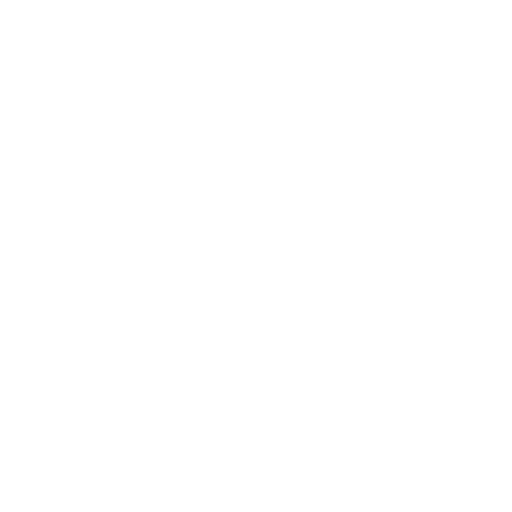 |Capture the Flag  |Defend    |Dropped flags must be defended until they reset             |
|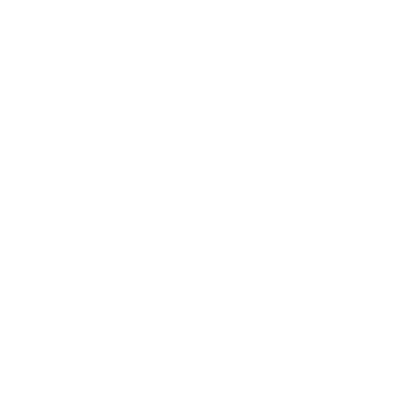|Capture the Flag  |Protect   |Protect the flag and hold the enemy flag to score           |
|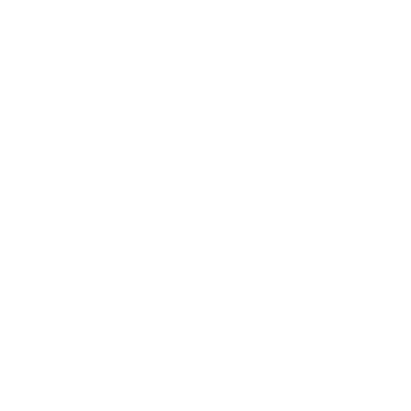   |Defend and Control|Quick     |Control points secure quicker than normal                   |
|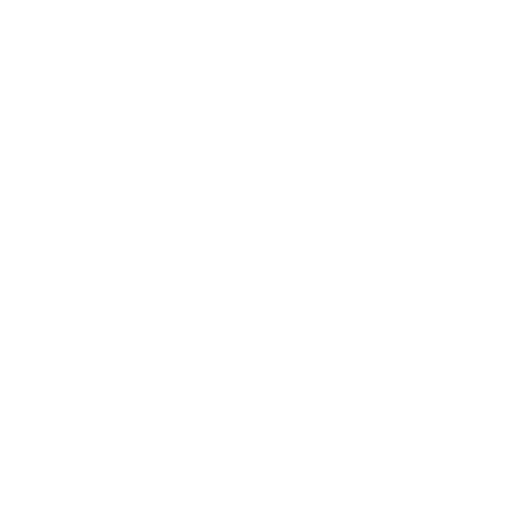    |Defend and Control|King      |Remain king of the hill to score                            |
|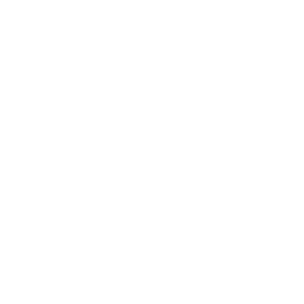    |Bomber Ball       |Hold      |Hold the bomb as long as possible to score                  |
|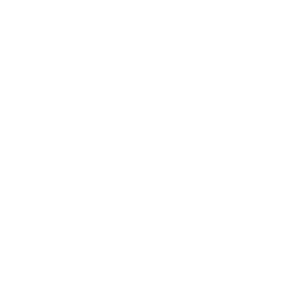  |Bomber Ball       |Basket    |Throw the bomb into the enemy goal to score                 |
|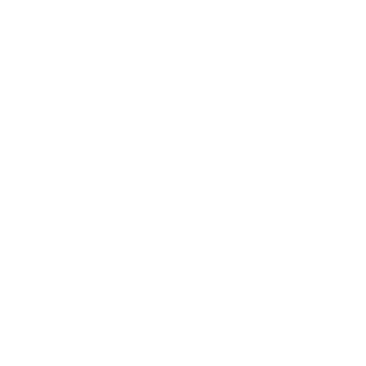 |Bomber Ball       |Assault   |Teams take turns attacking and defending                    |
|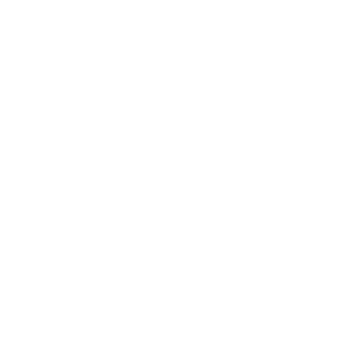    |Race              |Lapped    |Compete for the most number of laps                         |
|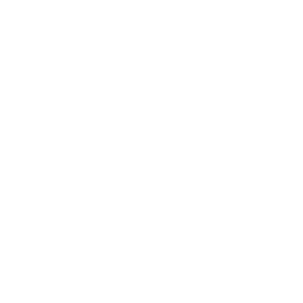 |Race              |Endurance |Laps must be completed without dying at all                 |
|  |Race              |Gauntlet  |Teams take turns running the gauntlet                       |
