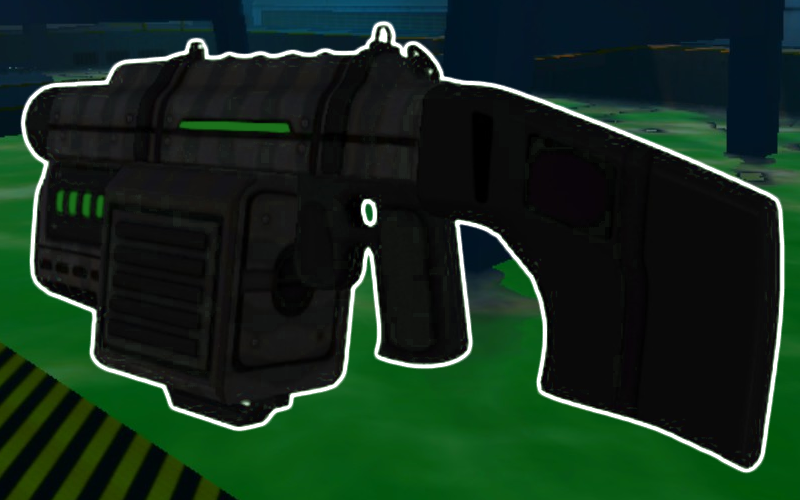
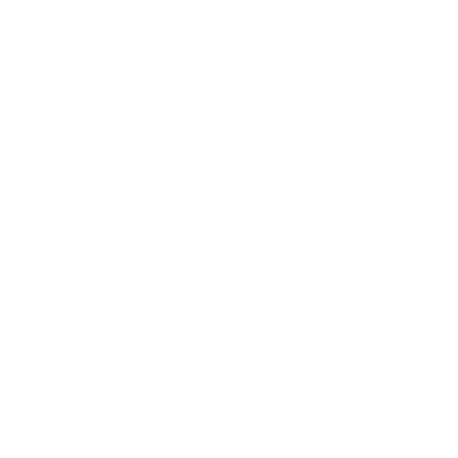
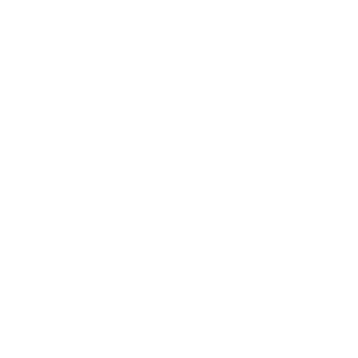
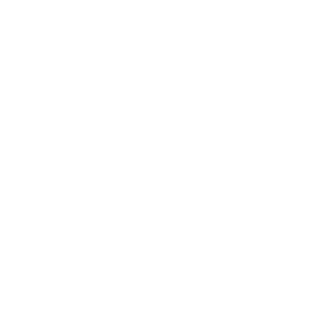
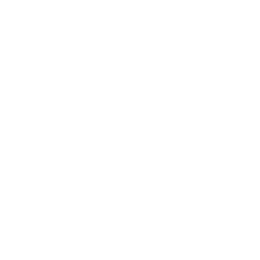

* TOC
{:toc}
## Corrosion Cannon

[Click here to return to the main page.](Weapons-Guide)

| Utility | Power | Difficulty |
|------------------|--------------------|---------------------|
| Elastic (☆☆☆☆) | Extreme (☆☆☆☆☆) | Very hard (☆☆☆☆☆) |

### Description

In the right hands, the Corrosion Cannon is a stunningly strong weapon, held back mostly by its slowly moving attacks, difficulty of usage due to the lobbing projectiles it fires and the collateral damage it causes to your team. With decent short- to mid-range coverage, a charitable ammo supply (which runs out rather quickly with the primary fire) and firepower that can hardly be matched at such range, it promises a lot of easy kills, provided you aim well... and if you don't, you still have a fair chance. A surprisingly quirky gun - it can do a lot of things that most other weapons can't, which could be good or bad, depending on the context. Both of its fire modes allow you to deal damage over time to your enemies as well, and while the effect isn't particularly strong, every now and then, it can net you an extra kill or two, which is always something.

### Primary

Primary fires a stream of green acid that can be recolored by an adept modder to look like bodily fluids. Deceptively powerful, especially when headshotting, but usually you will have a hard time doing that due to the slow projectile speed of this fire mode (though it's faster than the alt fire, still) and lobbing aiming arc. The lobbing, however, also provides you with a rather interesting advantage - aiming upwards means the acid stream will travel further, making it usable at medium ranges if you utilize some movement prediction. It's also a beast at close ranges thanks to that, but distance barely changes the difficulty of its use, and a weapon like the Flamer has a much easier time hitting things than this by comparison.

### Secondary

Alt fire ejects a blob of acid that functions simultaneously like a low splash radius contact grenade and a mine at once. Its lobbing arc is offset slightly above where you're aiming. This must be memorized if you want to directly hit people with this thing at short, medium and long ranges. At short ranges, you can usually get away with aiming straight ahead of you without correcting your projectile's trajectory because of that (though that may sometimes have you lob a projectile over your enemy's head), but at medium ranges, you do have to aim upwards, and there is really no good suggestion to have here but to feel out the arc of the blob with this in mind. Understanding how to use this fire mode is very rewarding, because a clean headshot will instantly kill your enemies. And it has to be clean, because the splash radius of the blob is miniature - it spews big globs of acid around it, so it doesn't exactly hit all the time, either.

Of course, this is not to forget the primary functionality of the alt-fire: if a projectile misses, or if you deliberately shoot it on the ground, it will stay there for a while, allowing you to build up a giant mine field over time even if you're just trying your hardest to hit your opponent. This is a tremendously important thing to understand: the area denial capabilities of this gun are crazy even with severely reduced limb damage (technically every weapon has reduced limb damage, but this means stepping on mines will not instantly obliterate you), which is why it's also such a versatile weapon. Moreover, any mine laying on the ground in close proximity to a player that just stepped on another mine (or got hit by a blob in mid-air) will get attracted to said player and absolutely decimate them, and you can build up mine fields from quite a long distance.

Important to note down is that blobs, just like Plasma projectiles, have a "graze range" where they deal minimal damage without exploding. This is good to know because, for one, it allows you to apply the corrosion effect regardless. But second of all, this "graze range" still triggers the attraction functionality of nearby mines, so even if that mine in particular is not destroyed, the rest will jump at your enemy. A really good alt fire, if not a little susceptible to getting shot down even in mid air due to the projectiles being fragile. With that in mind, do not shoot blobs at one another - they will both explode, wasting the mines. Though that part is going to be changed sooner or later... a new feature is planned to be added, which is blobs that will grow in size (and damage) upon being shot with the Corroder.

### Tips

With this weapon, the first important thing to understand is that you want to reduce collateral damage caused to your teammates while using it. In FFA, you can just keep firing at everyone and somebody will eventually run into your missed projectile, but in team game modes, at least think a little where you're firing the alt fire. If you absolutely must, you can fire it in your base to try and attempt somebody stealing your flag or to protect said flag from getting captured, but friendly players or bots might later step on these and you may teamkill them, so it's a little better to use the primary in this case. Spraying mines around an enemy's base, however, is a good idea, since it's an investment for the future. Getting up close is not so bad with this gun, either. Another good thing to remember is that both the primary and alt fire are gravitized, so on low gravity maps, their effective range extends somewhat.

### Counterplay

The Corroder lacks projectile speed, which is the main weakness of this weapon. It's hard to hit with the primary already as it is - spare for point-blank ranges - while the secondary is even slower and very easy to see coming. Attacks at long range or quick hit-and-run tactics can be particularly frustrating for Corroder users because of that. Another problem regarding this weapon is that its alt-fire projectiles can be shot down even mid-flight, which you can exploit with rapid-fire weapons (provided you aim directly at the blobs they fire). Do not let them play with you at their desired range. Finally, open spaces are ever so slightly more undesirable for this weapon due to its minelaying capabilities - the more room their enemy has to move, the less likely they will accidentally step on a mine lying on the floor and the easier it is to dodge the plodding projectiles. Try to force them out in the open and see how it goes.

### Strengths & Weaknesses

**Strong against:**

| Weapon | Explanation |
| :----: | ----------- |
|  | You outrange it and pose a pretty decent threat both mid-range and at its effective range. Being able to spawn a field of mines on demand also makes it a little tough to get to you in the first place as well, provided you are resourceful when running away. The only caveat is that you have to aim well, but it's not particularly hard to do against somebody that tries to bumrush you straight ahead. |

**Weak against:**

| Weapon | Explanation |
| :----: | ----------- |
|  | They can very easily shoot your projectiles down, which is made even easier by ricochets and the alt-fire. But that's about it - using the SMG against you is neither a counterplay, nor a strategy beyond that. |
|  | They will try to stay far away from you, and since you operate at mid range, you are somewhat disadvantaged by default against the Rifle. It doesn't help that your projectiles have a slow travel time and, if forced to fight at long ranges, you will slowly build up a mine field, but get an increasingly higher chance to get sniped instead, so you may not even get to use that function. Get up close and melt 'em. As a side note, it's incredibly funny to spam mines around a Laser Rifle user while they're not looking. |
|  | The one weapon that is remarkably decent against you at short range is the Energy Sword, which may seem surprising. Sure, you have the damage potential, but an adept Sword user can zoom around you, cut you up and leave without you leaving as much as a bruise, since your projectile speed is slow, and being light-footed helps when evading your mines. A smart opponent will respect the power of your primary and not take their chances when threatened with imminent death, but that is not much consolation when faced with somebody that you will have a hard time hitting. |
