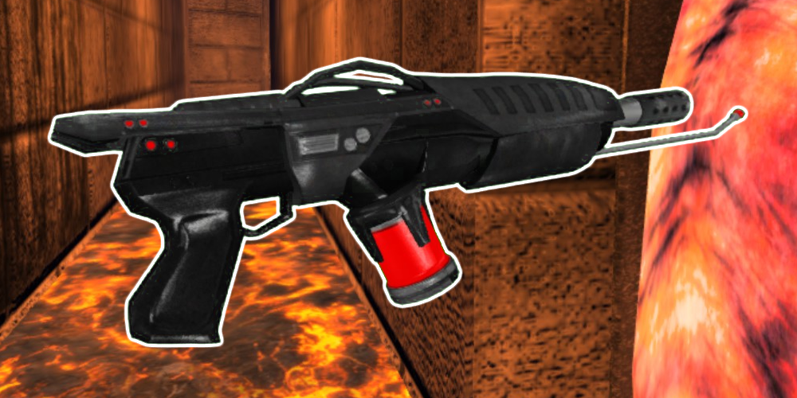

* TOC
{:toc}
## Flame Thrower

[Click here to return to the main page.](Weapons-Guide)

| Utility | Power | Difficulty |
|---------------------|-----------|----------------|
| Versatile (☆☆☆☆☆) | Low (☆☆) | Very easy (☆) |

### Description

A great weapon for beginners and pros alike, the Flame Thrower excels at two things: close quarters combat, where it wins out with every other short-ranged weapon, and crowd control, where it is unparalleled by any other gun, spare for pick-ups. Its generous aiming arc is another huge plus, and it can be used for a variety of things. Contrary to what it may seem like, however, its damage output is subpar compared to other weapons, especially when taking into consideration how quickly it burns through its ammunition. The Burn effect it induces somewhat makes up for it, but its another, very obvious shortcoming is that its range is very limited. Luckily, that can also be somewhat mitigated with parkour!

### Primary

What the primary fire mode does for the Flamethrower should be obvious - it shoots flames. They take up a solid amount of space and fuck up people's vision since they cover up an area in front of them, which generally means they will have a hard time hitting you while getting burned. They bounce off walls a little bit, so they can hit you, too, but a Flamethrower user needs not worry about this part that much (see: alt fire). They also penetrate through enemies and are the main reason why this weapon is so good for crowd control. Set a bunch of motherfuckers on fire at once and then watch as they die one by one. Just be mindful that you will have to refuel very often if you spray your flames around liberally.

### Secondary

Alt fire for this weapon is the main reason for its high Utility rating. It does a lot of things. It can extinguish burning players (including enemies, teammates and you). It can push back enemies, which is very funny when it throws them off maps like Dutility, but it's also a great tool if you just want somebody to fuck off. Not to forget that this nasty pushback effect can be used for juggling your enemies in the air, though switching to other weapons during that may not be the easiest. It deals damage, too, although that's more of a small bonus. You can use it if you ran out of impulse to airblast yourself upwards, or quickly redirect yourself against a surface to dodge an attack, or even boost your jump with it, it's a helpful little utility.

But the alt fire is, most importantly, a key player in a special tech available only to the Flamethrower. First, fire a bunch of flames at your enemy's general direction, then airblast them into the flames. If done correctly - which is hard to do, and not even the writer of this guide knows the specifics, but aiming at the torso area provides the most consistent results - this will deal ridiculous damage, because the airblasted player will then get repeatedly damaged by the same flame puff. For best case scenarios, this results in your enemy dropping from 100 to 20 HP, which is close enough to an instant kill that it usually makes people regret rushing at you. Doing this trick while juggling an opponent is harder, but it's definitely possible and just as rewarding - the flame puff and the airblast themselves have more flesh to go through vertically than horizontally.

### Tips

In enclosed spaces, the Flamethrower is a beast. Chasing down people and roasting them until they're ready to serve should be a priority for any self-respecting pyromaniac (with possible cannibalistic tendencies). They will be scared and run away if they know what's going on, though, so you gotta keep chase. It helps to know the map well to ambush people more effectively. But remember, you're just as squishy as everyone else is while holding the Flamethrower - sometimes a little more than others, since you will often set yourself on fire - so don't get some strange ideas in your head that you can run head-first at somebody holding a Rocket Launcher. Besides the quirkiness of the alt-fire, though, this weapon is relatively simple to use, so there is no real need to explain this any further.

### Counterplay

Aside from the obvious idea to get out of the Flamer's effective range, its primary is less potent near water - since you can put yourself out - and unusable underwater. Swimming makes you an easy target for other weapons, however, and it does not prevent the use of the air blast, so keep that in mind. But usually, you just want to run away from the Flamer user and get away from crowds so that they don't kill everyone all at once (the Flamer user is then forced to pick and choose which target to follow). It's important to remember that even making vertical distance tends to be enough to get out of their effective range - run up walls, but make sure you are not just hanging in the air afterwards, since a good Flamer user will juggle you, and even an average one that isn't very adept at juggling can easily resume damaging you. If it's a team game, get close to their teammates (provided it's a much safer option) - the width of the flames will easily deter careful players from trying to attack you, and the reckless ones will make it easier for you to kill their allies.

### Strengths & Weaknesses

**Strong against:**

| Weapon | Explanation |
| :----: | ----------- |
|  | The Shotgun may have a slight range advantage and colossal damage delivery, but its effective range practically overlaps with the Flamethrower. While they're not entirely defenseless, you will find that the curtain of fire the Flamer produces easily distracts and dispatches Shotgun users. And if you're fighting a particularly feisty Shotgun user, you can just airblast them away so they fuck off and switch to something that will do the job better. |
|  | With the airblast, no Sword user has any business dealing with you. But if they do, murder them in cold (hot?) blood. That's all that needs to be said. |
|  | Like the rest of the close-range weapons, the Flamethrower will absolutely decimate anybody using the Laser Rifle, provided they can get up close and personal. And close up and personal, you will be, for you are faster than the Laser Rifle by a large margin. Bonus points: burning people makes aiming not that easy, and the Flamer is quite light. |

**Weak against:**

| Weapon | Explanation |
| :----: | ----------- |
|  | Usually, getting close to a Corrosion Cannon user means crossing a minefield or getting acid burns, no in-between. Getting a mine lobbed at your head is one problem. The primary of the Corrosion Cannon has a surprising range when used correctly, since it also lobs, so that's another problem, the Flamer is ever-so-slightly outranged. And even at close range, you will find a worthy opponent in an Acid Gun user who knows how to aim. Your only saving grace is that the Corrosion Cannon is hard to use. |
|  | The SMG user can annoyingly stay out of your range while also being in their own effective range constantly. Engaging somebody like that is a big problem for you, since you require to get up close, and that's not so easy when they can get away so freely. It doesn't help that both of these weapons get an advantage when fighting in cramped rooms. |
|  | Another weapon that can stay out of your range and pepper you with bullets until you die. Its alt-fire can pull you in and make you helpless for a couple of seconds, or at the very least completely change your movement trajectory if you don't wanna get sucked in, so that also throws a wrench into your rushdown strategy. |
