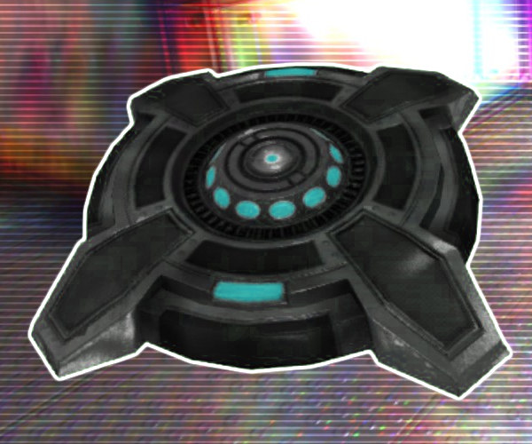

* TOC
{:toc}
## Shock Mine

[Click here to return to the main page.](Weapons-Guide)

| Utility | Power | Difficulty |
|-------------------|---------------|---------------|
| Adaptable (☆☆☆) | High (☆☆☆☆) | Very easy (☆) |

### Description

Primarily used as a trap, the Mines are a powerful area denial and trolling tool. They have this cruel side-effect of shocking people that step on them, too, so anybody that is unfortunate enough to be caught in the splash radius of one will have trouble living through any fight due to their mobility being severely crippled and their health slowly trickling down. What they lack by being limited-use pickups, they make up for with their versatility, which allows them to be useful even in direct confrontations. Just be absolutely, positively sure you don't kill your teammates or yourself with them.

### Primary

With the primary fire mode, you throw a regular mine forward. It gravitizes as you'd expect out of a thrown projectile, but not nearly as heavily as you'd think, and unlike the Grenade or the Corroder, it does not lob upwards when aiming straight forward. When it lands, it sticks to a surface and waits for any unfortunate sap to step on it. Very simple, but it allows you to utilize certain nasty strategies.

One such strategy is just throwing it at people. Half the time, the mine will make contact with the person and explode immediately, most likely killing them if they do not shoot it down in the air first. The other outcome is that it will stick to them if it makes contact with the non-explosive surface. This creates hilarious scenarios where you will have those fellows desperately try to run up to you before they die, as a mine being put on you is a guaranteed kill (once a mine expires, it will detonate). Even if you miss your throw, the mine will still be there, so it's not like you completely fucked up. You can also shoot the mine off your target to put the player out of their misery.

Another one is to put it in places people don't expect or hotly contested spots, like on your flag, near a control point, near your bomber ball goal (just be mindful of your teammates), or perhaps near doorways or in cramped corridors. It is a comically evil strategy that works very effectively against unattentive players, and even against wary ones sometimes - after all, sometimes when you run fast, you just don't notice such tiny details.

Lastly, you can put the mine on yourself with some practice and play kamikaze. Is this really a viable strategy? Probably not, but it's funny enough that you may want to try it anyway. Nothing is quite as liberating as crashing into an entire crowd and blowing them to bits.

### Secondary

*NOTE: The secondary is supposed to work like this, but it's currently bugged and doesn't shoot out the intended laser. This will be eventually patched. For now, treat it as the primary with a different trigger.*

As for the alt fire, it creates a laser tripmine. As in, it literally fires a laser when tripped. The said laser is incredibly devastating and, like every other projectile in the game, can headshot stupidly well, though you do not need it to. It also extends a ridiculous distance, so you can sometimes create a trap that fires a laser across half the map. Very funny. Its usage is not that different from the primary at first glance - you just stick it to surfaces and it does its thing. It's not recommended to stick it to people, though, because this makes it much easier for them to aim that laser at you and kill you with it. Because of the big laser marker that is plain for everyone to see, it is also not recommended to hide it on objectives.

So how do you use the alt fire? Simple - the visual cue that an area is blocked off is a psychological advantage. This will make people feel uncomfortable when approaching objectives, so covering a place with those mines will have them slow down a little bit or take a less optimal route just to avoid the possibility of dying to the laser tripmine, and there's always the threat of making a mistake during that process and dying. Put it in doorways and watch as people fail to slide under them or jump over them. Make it guard a flag or bomberball goal and enjoy their suffering when they can't actually run in like a moron anymore. Of course, this is not to say the surprise element of the primary is completely removed - it can still be placed well at the beginning of a doorway and catch people off guard. But clearly, it's not as good at that.

### Counterplay

The best thing you can do against Mines is to shoot them down, as there is not much you can do against them otherwise. Sometimes you may wanna preemtptively hose down hot spots where a mine or two may be placed - like under an enemy's flag or bomber ball goal. Sometimes you may just wanna be careful and not rush through a hallway like a moron. The main issue is that it's hard to predict where a Mine may be placed unless one of its users has a particular tendency to put them down in certain spots, or it's the alt-fire. For starters, since it's a pickup, not everyone has access to it at all times, so that severely limits the abundance of mines that will be placed during a game and you'll probably forget they even exist until you step on one. Unlike the Rocket or Grenade, they give practically zero heads up to anyone regarding their use, so if you're not there while it's being set down, you may be in for a surprise. And once it's out of the player's hands, all you can really do is listen for the very characteristic noise it makes when you're close to it, because Mines are a set-and-forget sort of weapon, requiring zero involvement from the user afterwards. Exercise caution.

### Tips

There is not much to suggest beyond what was already said. Put the mines in smart places and don't kill your teammates with them. Have fun. That's it.

### Strengths & Weaknesses

**Strong against:**  None.

**Weak against:**  None.
