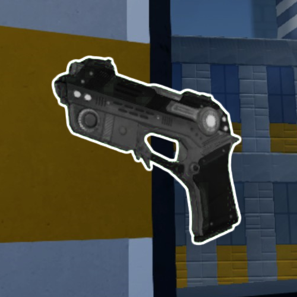

* TOC
{:toc}
## Sidearm Pistol

[Click here to return to the main page.](Weapons-Guide)

| Utility | Power | Difficulty |
|---------------|---------------|----------------|
| Limited (☆☆) | Medium (☆☆☆) | Hard (☆☆☆☆) |

### Description

An unexpectedly powerful weapon, the "Sidearm Pistol" (what a name) has the highest DPS in the game. Accurate headshots with this thing will reduce people to dust. It's a little boring, has a small clip, is not automatic and requires you to be a true marksman to score a kill. That last part holds back its potential damage output significantly and is the main contributing factor to its difficulty rating - it's not easy to be precise with it, since the projectiles are hard to feel out and slower than they appear. However, it fills mostly any role that every other weapon does, kind of like the Zapper. Definitely a viable fallback option, which is what it's intended to be.

### Primary

Primary fires a VERY boring projectile that you can't really write much about. You can fire it pretty fast, I guess. And it deals crazy damage if you hit with it. That's... that's it? It just flies forward and hits things, there's really nothing that can be said here. Oh, I guess lead your shots a bit even when not firing at a distance. Just do not underestimate its power, it's a hidden beast hindered only by its inherent clunkiness.

### Secondary

*NOTE: The secondary is completely broken at the moment and rarely, if ever, hits anyone. Use at your own risk.*

Alt fire is a pistol whip. It does not cost any ammunition, it's a short-ranged melee attack. It deals okay damage and you can thwack people over the head pretty past. Again, pretty boring, but the Pistol does its job of being a filler weapon very well.

### Tips

Are there any interesting things that can be said about this gun? You kinda have to be accurate with it, which is where the main difficulty of using it comes from, but that's just restating what was said above. If you're using something like a Sword + Flamer build especially, or something short-ranged overall, having anything like this on you at all times is invaluable, even if it's a wonky way to punch beyond your range. You can also use it to shoot off mines that you spotted without wasting ammunition for your other weapons. In general, that's a very good use case for this gun - to not waste ammunition - though it's not like it's particularly hard to go and grab an ammo box in this game unless the map has none, which should never happen on official maps. Picking off people when you have no other weapon that can do this (like, say, the Zapper or SMG) is also possible with the Pistol. And, of course, when you do somehow run out of ammunition, having the Pistol means you're not entirely defenseless, though some mutators (most notably, Instagib and Kaboom) take it away from you and leave you with either the Claw or nothing at all.

### Counterplay

Being a last resort weapon, any player that is forced to use the Pistol is not in the most desirable situation already, which means they are a free pick for anyone willing to kill them. There are situations when a player will want to use it when they have not ran out of ammo, however, so do take note of that - in particular with short-ranged loadouts like Flamer + Sword that need any range they can get. But most of the time, even though it may be a more effective weapon for certain situations, players will not willingly switch to the Pistol simply due to the difficulty of landing any hit with it. You may see new players experimenting with weapons and using it sometimes, which is pretty common. So what is the best counterplay against the Pistol, then? It may sound a little boring, but it doesn't get any simpler than that - exploit your enemy's temporary weakness at any range you desire. Other guns have much more sophisticated counter strategies.

### Strengths & Weaknesses

**Strong against:**  None.

**Weak against:**  None.
