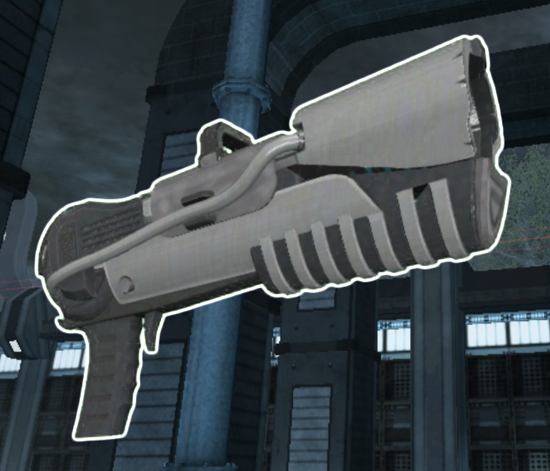

* TOC
{:toc}
## Plasma Inductor

[Click here to return to the main page.](Weapons-Guide)

| Utility | Power | Difficulty |
|------------------|---------------|------------|
| Elastic (☆☆☆☆) | Very low (☆) | Easy (☆☆) |

### Description

A capable, easy to use energy gun that mostly underperforms in the damage department (which does not mean it can't kill), the Plasma Inductor should be treated more as a support weapon. It probably should not be used extensively as the main damage dealer, but it can respectably hold its own in mid-range combat, so it's a valid option regardless. With its versatile alt-fire, low ammo consumption for the primary and a slow firerate, it is tailored more towards defensive gameplay, and is always a neat option for players that have just started out with playing the game.

### Primary

Primary fires a small, glowing plasma ball. It travels fast, but slower than most projectiles (that being SMG, Shotgun, Laser Rifle, Zapper), so its effectiveness beyond medium range sharply drops off and requires some shot leading. The plasma ball, even if it misses, can still graze enemies and deal a little damage. Don't be afraid to target your enemies' torsos with this - headshots are nice and mostly every weapon has its damage output improved significantly with those, but this fire mode is surprisingly generous with its body shot damage, and you want to ensure you hit somebody more than anything. This also makes fighting at specifically medium range advantageous - you can keep out of your enemies' effective ranges while constantly damaging them. However, the primary kind of sucks at any other range, mostly because you will be outperformed in both departments, so make sure to properly distance yourself.

### Secondary

Alt fire is a plasma ball, too, but this one grows in size depending on how much you charge it, attracts enemies and repeatedly deals damage to whatever unfortunate soul gets sucked in. At max charge, it uses up your whole clip. The biggest plasma balls are unfortunately prone to also sucking you in, so make sure you are already moving in the opposite direction so that does not happen. This is a fantastic zoning, trapping and, theoretically, parkour tool.

Just by firing a 1/3 or 1/2-charged alt fire, you can ensure that your enemy will change their trajectory so that they avoid getting sucked in, and damned they are if they don't, they'll get sucked in. This means you can very easily get annoyances away from yourself, provided you use it right. Unfortunately, very low charges seem to be a waste of ammunition as they fire short-lived projectiles with a pathetic attraction range, so make sure to always charge it up a little if you don't want to be disappointed.

For particularly thin walls, you can use it to hit through them - a very annoying effect, doubly so since it sticks people to whatever surface they're being pulled towards. A good example for this is Dutility's middle room - fire it on top of the roof and there's a good chance you'll get somebody underneath stunned. In general, firing the Plasma alt-fire so that it pulls people into a wall or other kind of surface also helps increase the chance that they'll stay in one spot like good little target dummies, but a clear drawback behind using it this way is that half (or more) of your projectile's radius ends up completely unused.

The problem with this alt-fire is that, for one, the plasma ball takes time to activate, so you can't just spawn it when your opponent is practically touching you, or they will not even get pulled close to it. Another thing is that sometimes, if the opponent moves fast enough and you're unlucky, the pull from the plasma ball may actually accelerate them forward, which will close the distance between you and them further. For that reason alone, it is possible to use this as a parkour tool, but this is strictly theoretical as no attempts have been made to use it as such yet. Oh, and it's worth mentioning that the alt-fire does burn through your ammunition, unlike the primary, so make sure to keep that in mind.

### Tips

Positioning for the Plasma Gun is very important. You never wanna be too close or too far from your enemies so that both your primary and alt fire stay effective at all times. Since the projectile is quite wide, aiming down corridors may help you hit your enemies way better, and there's the fact that the alt fire blocks those off exceptionally well, too. You will need to hit your enemies more consistently than with other weapons to kill them, but this should not be nearly as hard as with other guns. Make sure not to be a dickhead and get your allies stunned by the alt-fire, though.

### Counterplay

Plasma has a notorious DPS weakness, where its damage per shot is great, but due to its slow firerate, it takes longer for it to kill than most other weapons. Besides playing at range, you can instead opt to rush down a Plasma user with the right loadout, and it will likely succeed if their parkour game is inferior. After all, all close-range weapons have a better damage output. This problem is further amplified by how the alt-fire functions: the giant projectile ejected from the gun can and will miss you entirely at point-blank range if you are chasing after them. It's all about preventing Plasma users from correctly positioning themselves, and when you can consistently do that, you can win convincingly. Also, avoid tight hallways and other cramped areas - that's where Plasma can be painful to fight against.

### Strengths & Weaknesses

**Strong against:**

| Weapon | Explanation |
| :----: | ----------- |
|  | Since the Plasma Inductor is a good zoning tool, the Flame Thrower will find it hard to get to you, provided you play your cards right. You absolutely should not get close to the Flame Thrower - you'll be instantly outperformed and die a pathetic death. Keep shooting at them, get them stunned, and they will fall before you. |
|  | Sword users hate getting their momentum killed, so your alt-fire is pretty dreadful to them. There is also the problem with your primary being quite easy to hit, but they can get through that. This is not really that big of an advantage, but it still helps to know that you have good options against the Sword user. |

**Weak against:**

| Weapon | Explanation |
| :----: | ----------- |
|  | Having to stay mid-range to be a threat to the Rifle user at all is... not very good for you. The sniper won't find it too difficult to headshot you at that sort of distance, and you will not kill them all that fast from up close. It's just not a very good match up. |
|  | Another weapon that outperforms you even at your desired range. Your best bet is probably getting up close to the Zapper and using your alt-fire before they use theirs, or just switching to another weapon. It's best to stay away from Zapper users for you. |
