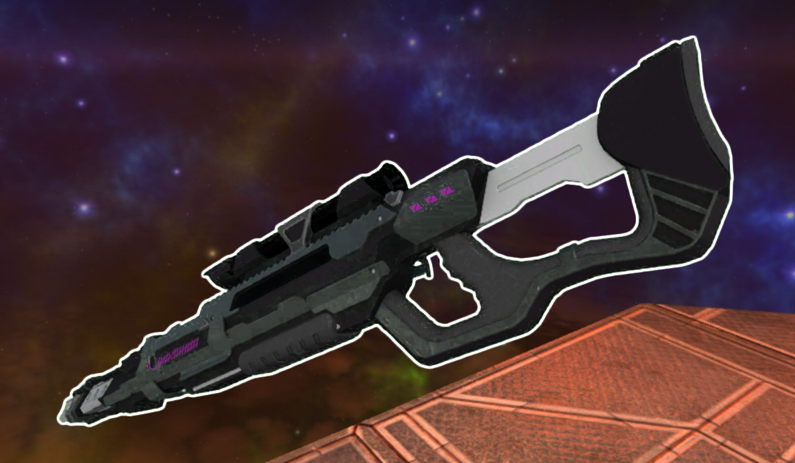

* TOC
{:toc}
## Laser Rifle

[Click here to return to the main page.](Weapons-Guide)

| Utility | Power | Difficulty |
|-------------|-------------------|---------------------|
| Strict (☆) | Extreme (☆☆☆☆☆) | Very hard (☆☆☆☆☆) |

### Description

A very well-balanced sniper rifle with great damage projection over the longest of ranges. Using this thing takes nothing more but extreme proficiency in aiming - EXTREME proficiency. Add to the fact that Red Eclipse has a parkour system and it suddenly becomes very obvious why the life of a sniper in this game is not so blissful. However, the Laser Rifle should never be underestimated - yes, it makes you move slower than a sloth in a wheelchair, yes, it fires slowly, yes, it's inconvenient to use from up close and yes, it takes forever to reload, but being able to instantly kill a player over any range with a well-placed headshot speaks for itself.

### Primary

Primary is a quick unscoped shot with the sniper rifle. Useful when being approached, this won't instantly kill your enemies with a headshot. Matter of fact, you may be a little disappointed with the damage at first. But it's still a good option and you should not underestimate it. It fires faster than the alt fire and is just as accurate without letting you develop tunnel vision syndrome. It's recommended to master this for the Instagib mutator, especially.

### Secondary

The secondary takes a bit to scope in and charge up, but it deals decent bodyshot damage. Of course, it also kills people with headshots. Instantly. It's not as simple as just playing a point-and-click adventure game in this case, since enemies have a fair amount of time to get out of your sight before you get to fire, and each missed shot means you will have to wait way longer than for the primary to fire again, and against what it may seem like, it's also a projectile weapon. However, the damage is more than worth it. There isn't that much reason to use this in Instagib, though, spare for really long distances...

### Tips

The best way to play with the Laser Rifle is to stay the FUCK away from your enemies' reach. Only the Zapper can really do anything to you at your preferred range (which is a match minimally in favor of you, anyway), the rest is powerless against you until they get in your range. And if they try to get up close, just get the fuck outta there. Utilize vantage points, find good sightlines and take cover frequently, because you don't want to get shot out in the open. But even if you're caught up close, remember that you can still shoot people, and any low health MORON that dares approach you thinking you're a coward is making a huge mistake. Moving around while sniping people is an important skill to master, too. Did you know you can still use your impulse while scoped in? That's right. Keep that in the back of your head.

### Counterplay

The obvious suggestion is to get up close and personal so that the major strength of the Laser Rifle is sapped away from it. But what if you can't? Move a lot, spin in the air, do whatever weird and freaky moves you want that will make hitting you a real challenge. Sliding or crouching often is a good way to make hitting headshots harder, and knockback generated by certain weapons (e.g. Grenades or Flamer) can further enhance your dance move arsenal. Keep track of the sniper's position at all times so that you do not suddenly get surprised with an instant kill from half across the map. Avoid open spaces or tunnels where you can be easily shot down (unless your weapon in particular excels at fighting in cramped areas; though there is nothing quite as powerful as the Laser Rifle in large, open spaces). Harass them from a distance to make their job harder than it already is. But do not, absolutely do not ever stand still. If you stand still, you will die.

### Strengths & Weaknesses

**Strong against:**

| Weapon | Explanation |
| :----: | ----------- |
|  | The SMG doesn't have that much to offer against the Laser Rifle, and playing the ranged game with it is a surefire way to get laser burns. It's as simple as that. |
|  | Its alt fire is out of your reach for the most part, and its medium-range projectiles are not very effective at long ranges, which is where you will be primarily attacking from. The Laser Rifle isn't a hard counter, but it's also very strong against that gun, still. |
|  | What does the Laser Rifle have that the Corrosion Cannon doesn't? Range and near-instant damage potential. You can rather easily move out of the way of the slow, plodding projectiles coming your way, and snipe the Corrosion Cannon player before they murder you. But don't be absent-minded - a smart player may use your tunnelvision syndrome against you and kill you with traps you thought missed you. |

**Weak against:**

| Weapon | Explanation |
| :----: | ----------- |
|  | Run if you can, because if you can't, you'll die, and the Flamethrower players move pretty fast. All the fire will fuck up your ability to aim, too. Be happy when they aren't targetting you. |
|  | Similarly to the Flamethrower, if you don't run from the Super Shotgun, you will die. As an added bonus, it has a longer range than the Flamethrower, which makes it debatably worse to play against in certain scenarios. Luckily, it's also the heaviest of the close-range murder weapons. |
|  | Like against a mosquito that's all up in your face and relentlessly stabs you with its stinger - that's about how it feels like to play with the Laser Rifle against a Sword user. The lowered damage potential only slightly offsets how quickly they can really approach you. Make sure you have some good weapons to fend off Sword users... or aim really well. |
