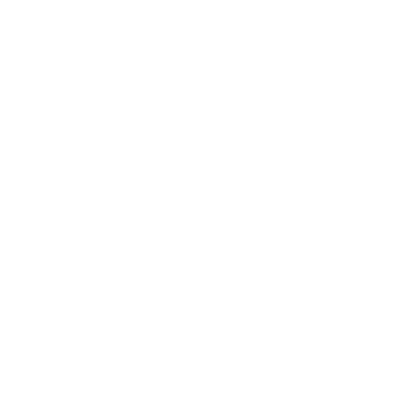

* TOC
{:toc}
## Rocket Launcher

[Click here to return to the main page.](Weapons-Guide)

| Utility | Power | Difficulty |
|-------------|-------------------------|----------------|
| Strict (☆) | Devastating (☆☆☆☆☆☆) | Very easy (☆) |

### Description

This weapon is an instant death magic wand. Point it at a crowd of people (preferably your enemies) and watch as they disintegrate the second the rocket touches them. There are two main drawbacks to wielding this colossal monster: for one, you move at a snail's pace. You can still accelerate and parkour like normal, but you're gonna have a hard time getting around. Another problem is that just holding this monster makes you visible through walls and a loud siren blares from your entire body, so everyone knows you have it. If you're large, you gotta be in charge, so using this weapon as soon as possible is preferable, although sometimes waiting a little for enemies to crowd up can be way more rewarding.

### Primary

Primary fires a big, extremely fast and hard to avoid rocket with a huge splash radius. Decimates everything it hits. Make sure to aim it at the feet of your target, rather than directly at the target, if you are on a level plane with your enemy. This will allow you to almost certainly kill them with the rocket's splash damage, rather than potentially missing a direct hit. Also, make sure not to fucking kill yourself with it. Maybe be a little careful with it when your teammates are nearby, too - though sometimes, clearing an entire crowd of enemies with one teammate in it may be a worthy, if involuntary, sacrifice.

### Secondary

Currently, the secondary is not very worth using, so just don't. It fires several small guided rockets in quick succession, which in theory sounds neat, but they move very slowly compared to the primary and therefore make it very hard to hit anything. They also have a lowered splash radius.

### Tips

Since it's so powerful, obtaining it on any map should be a priority, though it's not like you will eat shit and lose the game if you don't grab it a few times. But you might if you outright refuse to grab it while other players consistently do. And there's no shame in taking it either, really (if you care so much about your honor, just use the alt-fire or waste it). It may sound a little funny after giving the weapon so much praise, but killing one person really doesn't change much in RE, spare for some edge cases, and going "fuck you in particular" with the Rocket is usually something you'd do to prevents others from having it. Even missing with it still gives you an advantage, because your enemies don't get to have the Rocket, either. It's most influential in situations where you try to exercise radical crowd control or when you are attempting to break a stalemate on CTF, defend your bomberball goal, anything related to objectives, but even then, it's not like it's going to make everything a cakewalk for you. With some careful positioning, you can also use it to launch yourself away from your target as an escape option, since the knockback produced by this weapon has a larger radius than the damaging zone (it's also true for the Grenade, but it's very prominent here).

### Counterplay

Surprisingly, there are several ways to fight back against anyone wielding this deadly weapon, though none of them are guaranteed to succeed:

1. Get the FUCK outta there as soon as possible. Well, okay, it's not really "fighting back", but it's your first, most reliable option, and something you should always opt to do whenever you get the chance. Engaging a Rocket holder is suicide. You do NOT need to stay within their field of view. Get outta there and live a few seconds longer.

2. If you wanna try your luck, try ambushing them. Having the radar doesn't really help your surprise factor, but the point is to engage them when they have the Rocket holstered and kill them as soon as possible, NOT when they have that thing out. Sometimes, whoever holds the Rocket may decide that there will be a better opportunity to kill more people later, or perhaps in a different spot, so they will hold onto the Rocket and use their other weapons. It's a good time to strike.

3. Get up close in their face. Worst case scenario, the Rocket user will take you down with themselves, which means less points for them. Every other outcome is way better, however - after all, they may refuse to fire and try to cut you down with some other weapons in their arsenal instead. This gives you an opportunity to strip them of their big death stick, and it's not particularly hard to get close to somebody holding the heaviest weapon in the game.

4. Become a clay pigeon when you cannot run away, cannot ambush them or cannot get up close. What that means is you have to keep trying to earn a high ground. It's extremely easy for a Rocket user to use only the splash damage of this weapon to kill you when you are on the ground - forcing them to score a direct hit in the air may make them reconsider and wait so that they do not waste their shot, provided you also stay away from the walls while flying in the air, since the same principle applies. Of course, the main problem behind this is that eventually, you will hit the ground or run out of impulse, and when that happens...

5. The Rocket has one, extremely hard to utilize weakness - it can be shot down. Mostly any projectile will do it, from SMG ricochets to stray grenade shrapnel (which is why sometimes firing the Rocket near a lit grenade is a bad idea), but the key is accuracy. The primary fire moves insanely fast and the target itself is pretty small compared to something like another player. But if you do manage to shoot it down - and that is really your only way to get out of a pickle this deep in the jar - you successfully neutralize a possible instant kill for yourself and millions of other lives. Congratulations.

### Strengths & Weaknesses

**Strong against:**  Everything.

**Weak against:**  Nothing.
