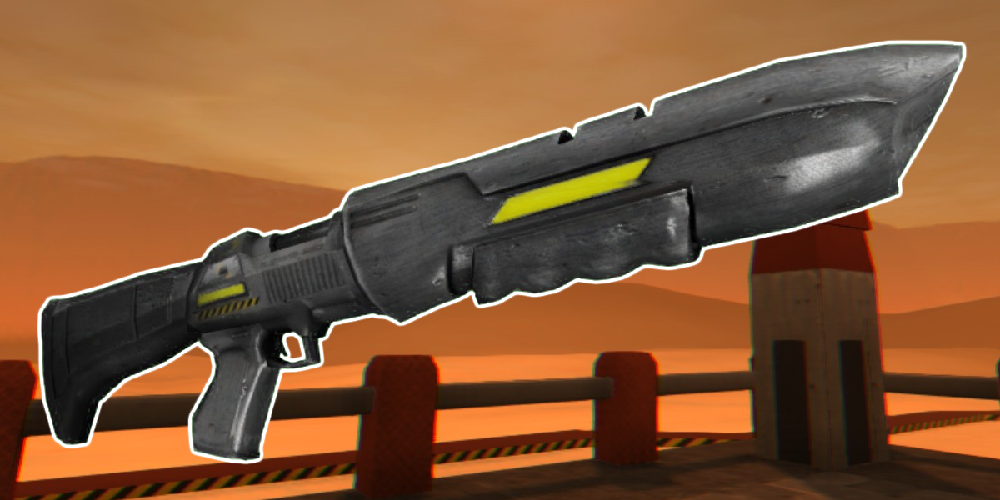

* TOC
{:toc}
## Super Shotgun

[Click here to return to the main page.](Weapons-Guide)

| Utility | Power | Difficulty |
|---------------|---------------|----------------|
| Limited (☆☆) | Extreme (☆☆☆☆☆) | Medium  (☆☆☆) |

### Description

A neat, short-ranged weapon and a favorite of many experienced players thanks to its simplicity of use and sheer firepower. Its two biggest drawbacks - range and ammo consumption - are conveniently outweighed by the fact that it can kill players instantly with a point-blank bodyshot, something that very few weapons in this game can achieve. Excels especially against single opponents thanks to its rapid firing and wide area coverage, but with a good enough player, this can turn into a crowd control weapon. Requires decent aim to use correctly and weighs a bit more than you'd expect a shotgun to, but you can still parkour swiftly with this.

### Primary

Primary is a spray of buckshot. Doesn't work well beyond a rather short range, but deals decent enough chip damage that it may be worth spamming it without switching to a longer-ranged weapon sometimes. Fires absurdly fast. Minces people with a single shot and has enough damage potential to kill a whole lot of people with a fully loaded chamber. Take note that it also ricochets, so you may surprise somebody with a blast to the face... including yourself.

### Secondary

Alt fire uses two shells to launch a big, yellow ball of death that explodes into shrapnel after either hitting a wall or traveling in the air long enough. Said shrapnel deals hefty damage on its own (provided it's not just a single piece grazing your enemy's skin), bounces off terrain and causes bleed upon hit. The only "long-ranged" fire option the Super Shotgun has, it's more of a flak cannon than anything and not worth using at short range (while it can insta-kill just like the primary, the primary only costs 1 ammo piece for immediate feedback). Highly situational, but you can catch people off-guard with it, especially pursuers, or if you feel like it, you can spam it over long distances in an attempt to hit multiple people with bleed.

### Tips

You want to be close to your enemies with the Shotgun, but you have a little bit of leeway - it's slightly longer-ranged than the Flamethrower, for instance, and deals respectable damage as long as it's nothing further than a few metres away. Use kick (Q) frequently, it may help you net extra kills if your shotgun blast almost killed somebody and you need to finish them off. They'll want to run from you, so make sure you give chase and don't let go, because the second they get away from your effective range, they're the ones with an advantage. Give yourself some time to reload it fully, since it's the slowest reloading weapon in the game, chambering only two shells at a time, and you don't want to be caught with that before a battle. Memorize where the ammo pickups are, you'll need them - the Shotgun burns through ammo very fast.

### Counterplay

While keeping your distance from any close-ranged weapon is generally recommended, the Shotgun will instantly kill you if you get within point-blank range, so it is especially a good idea to feel out how far you can keep yourself away from a Shotgun user without dying. Whenever you see them reloading, use that to your advantage as soon as possible. Their damage output will drastically fall off as soon as they blow their whole load, allowing you to be a little more aggressive while they can't fire and letting you exploit the slow burn that comes with inserting shells mid-combat. But for that, you have to survive long enough. If you are running after a Shotgun user, be wary of their secondary fire - it is very good at catching reckless chasers off-guard and completely obliterating them, but with enough awareness, it is easy to dodge.

### Strengths & Weaknesses

**Strong against:**

| Weapon | Explanation |
| :----: | ----------- |
|  | Come up to a sniper, blast them in the head, bam, they're gone. It's that simple. You can also harass them with the flak alt. You may not have the best range, but you have the means to approach. Unfortunately, you're slower than a Sword user, so you have to be a little more careful, but a Laser Rifle player should be running for the hills when they see you, not the other way around. |
|  | Just like the Flamethrower, you can make a Sword user's life a living hell simply by existing. They can't run up to you without a plan or you'll blast them to bits. Even if they do, there's a good chance you can shoot them and kill them instantly, anyway. Punish overconfident Sword users whenever you get the chance. |
|  | Approaching a Zapper user is easier than an SMG user - they have a much lower damage potential and their alt-fire only really works at short range, which is where you want to have them at all times. Naturally, they will try to pick you off when you're very far away, but you will have an easier time getting to them, and a Zapper user won't have much to say when faced with a wall of buckshot to the face. |

**Weak against:**

| Weapon | Explanation |
| :----: | ----------- |
|  | A dreadful match-up for the Shotgun user, the Flamethrower makes it hard to aim while simultaneously being VERY easy to burn people with. A Flamethrower user slightly discomforted by a Shotgun player approaching can also airblast them away. Avoid attacking them with this thing at all costs. Even with the recent range buff, the Flamethrower will still wreck your shit, though you at least have the means to defend yourself. |
|  | A smart SMG user will keep you at bay and riddle you with enough holes that you'll feel them for the rest of your life. An accurate SMG user will delete you from existence. You have the advantage in your effective range, which is not far off from the effective range of the SMG, so of course you must approach, but it will not be as easy as it will be for them to keep their distance. |
