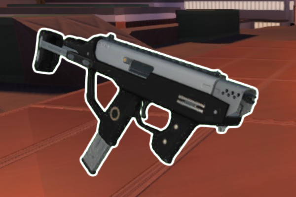

* TOC
{:toc}
## Submachine Gun

[Click here to return to the main page.](Weapons-Guide)

| Utility | Power | Difficulty |
|---------------|---------------|----------------|
| Adaptable (☆☆☆) | High (☆☆☆☆) | Medium (☆☆☆) |

### Description

Reliable, fast, damaging. The SMG is an accurate weapon, if not a little tough to score a hit with sometimes, perfect for those who like running and gunning. Its low weight makes it great for parkour maniacs and both of its fire modes bounce off level geometry. It is also surprisingly good at medium-range crowd control. Not a boring weapon at all, though it is neither particularly strong nor weak against others. You could call it a generalist weapon of sorts, very similar to the likes of the Zapper, but best suited for medium to shorter ranges and with consistency occasionally broken up by an unfortunate ricochet that ends your life. As a side note, its ammunition runs out quickly, but you will find that burning through your whole clip so fast is a small price to pay for the utter annihilation of your opposition.

### Primary

Primary fires bullets from your 40-round clip in rapid succession. Consecutive headshots shred through enemies, which is why having good aim with the SMG is important, but not a requirement to use this weapon well. A very interesting quirk of the primary is that its shots are capable of many ricochets before they vanish. They fly very fast, though slow down after each bounce. This means that firing this gun into a wall perpendicular to yourself is a bad idea that might get you killed - always angle your shots at least a little bit or change your position so you don't hit yourself. Another bonus of angling your projectiles to the side is that they increase the overall surface area those bullets take up compared to doing so perfectly straight, so you have a better chance to hit an enemy. This gun is also very good for firing from cover once you get a feel for it, and can net you surprise kills when your prey is trying to escape.

### Secondary

Alt fire is very finicky and funky. It fires a big bullet that costs 4 ammo, also at a pretty fast firerate, and it explodes, flinging small projectiles around it in a radius. Yeah, it's not actually an explosion, it's just a bunch of shrapnel. Incredibly hard to use against single targets, but very rewarding when learned correctly, as it can technically instakill any player with a well-aimed shot to the head. It's not easy, however, because the projectile explodes with a very strict delay. There is a sweet spot where the bullet will detonate right in an enemy's face - that's one way to earn an easy kill, but you have to maintain that sweet spot by repositioning constantly, and it's pretty tough to do in a game where everyone moves around so much. Another way is to bounce that projectile off a surface. Doing so will not only slow it down, it will also artificially shorten the sweet spot where the bullet will explode, since the projectile is not traveling in a straight line anymore and also slows down with a bounce. So the one case where this fire mode is easy to use is crowd control - fire away into a group of players and watch everyone in it die.

### Tips

Utilize the ricochet mechanic when you see an opportunity, it's there for a reason. It helps a ton when you can't afford to peek your head out, or when somebody is running behind a corner and thinks they're safe. But other than that, there is not much else to suggest with this weapon - it's just very good at what it does, which is killing people at medium ranges.

### Counterplay

A height advantage over an SMG user can be quite helpful in the heat of battle, more than against most weapons, since now their ricochets won't so easily hit you and they'll have to rely more on good aim to destroy you. On the contrary, you can stay near the ground and attempt to get them to hit themselves with their own projectiles, but this is neither that easy to accomplish, nor very practical. Being a generalist weapon, it is hard to pinpoint exactly what game plan an SMG user will adopt, so most of your "counter" play will boil down to simply playing the game.

### Strengths & Weaknesses

**Strong against:**

| Weapon | Explanation |
| :----: | ----------- |
|  | Playing the ranged game with a Shotgun user is not the easiest thing, and you will often find that the one thing the Shotgun is good at is precisely where you are outperformed - short range combat. But as the lighter weapon, you have the advantage in getaway situations, and you can just as easily mince a Shotgun player at medium range. It's a very interesting relationship between these two weapons. |
|  | The worst situation for a Flamer user is not being able to get in your range. And you can make those situations happen very often by simply running away and shooting them. The keepaway game is easier than for the Shotgun, since the Flamethrower has a much shorter effective range and, unlike the Shotgun, it can't hit beyond that range at all. It further doesn't help that while Flamers excel in close-quarters combat, preferably in cramped rooms, you also have that ability with your ricocheting projectiles. Just don't be a dumbass and run into the flames. |
|  | Primary can shoot down alt-fire projectiles with good enough aim, and the rapid firing of this weapon, combined with the ricochet effect, makes that more likely. Other than that, it interacts rather mildly with the Acid Gun. |

**Weak against:**

| Weapon | Explanation |
| :----: | ----------- |
|  | It's not that the SMG cannot do anything against the Sword - rather, its firepower doesn't, in any way, hinder their ability to get up close and stab you to death, which is primarily how using the Sword operates. You may occasionally get off a good alt fire shot under their legs and cause them to get knocked back, but this effect is so mild that it's not worth writing home about. |
|  | Similar case with the Energy Sword, where it doesn't do anything in particular to make the opponent's life worse, but it's ever so slightly more severe with the Rifle. The SMG can hit things over longer distances, but you don't want to do that with the Laser Rifle, which excels at killing you from a distance. Being opportunistic and using your enemy's moment of distraction is probably the best way to approach snipers with the SMG. |
