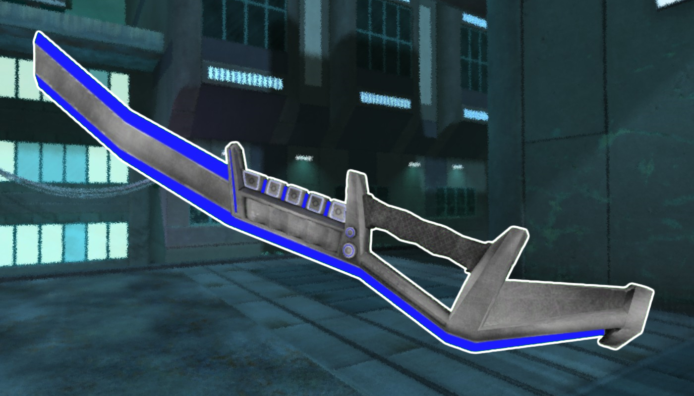

* TOC
{:toc}
## Energy Sword

[Click here to return to the main page.](Weapons-Guide)

| Utility | Power | Difficulty |
|---------------|---------------|----------------|
| Limited (☆☆) | Medium  (☆☆☆) | Medium  (☆☆☆) |

### Description

*NOTE: The Sword is easier to use in third person due to weird hitbox jankiness. This is being fixed by the developers.*

A strong weapon, if not a seemingly odd choice in a cybernetic future full of powerful ranged weaponry. It's one of the lightest in the game, so it doesn't slow you down at all when held, giving it a nice parkour utility. But otherwise, it's as simple as it gets: you run up to people and cut them the fuck up. Since it doesn't require ammo, you can repeat this process until the heat death of the universe, or until you die. While easy to learn how to use, mastering it is a whole another thing, and it doesn't help that every other weapon in the game is a gun - therefore it has the "medium" difficulty rating, as you have to learn HOW to run up to people without getting killed.

### Primary

Primary fire is an easily spammable horizontal slice that's not too hard to score a headshot with. If you let a toddler play Red Eclipse with the sword, they'd certainly get at least one frag by accident. Very good for hit-and-run tactics, since it requires absolutely zero commitment to any sort of timing. You'll eventually hit something.

### Secondary

Alt fire can be charged, and it's an overhead swing with the sword that doubles as an impaling attack, meaning it works for as long as the blade is set down in front of you. Ridiculously powerful and deals crazy damage with a headshot, but notoriously slow and has a narrow swinging arc, which makes it hard to use. But when you time it right, it's very much worth it.

### Tips

Both fire modes cause bleeding upon hit. Keep that in mind, especially when grazing your enemies, and don't forget to use your kick (Q) frequently with the Sword - it's free damage that can decide the fate of your enemies more than you'd think. Also, don't charge at people like a moron... at least not all the time. It's a tactic that works way more than you'd expect, but for the Sword, weapon match-ups are especially important due to its extremely limited range. Be a little more creative and wary. Jump down from walls, parkour up to them and then run away, remember that it grants you a ton of mobility that no other weapon has. It is also a weapon that, just like the Pistol, does not have a finite supply of ammunition, so you have the added bonus of not expending your resources while this blade is put into good use.

### Counterplay

A Sword user that cannot get within your range has their damage output castrated, but there are many ways they can get close to you that are the real problem. If the player is smart, they will take cover behind objects while you're firing at them, so force them out into open spaces - something that's rather easy to do if they are chasing you down relentlessly, but gives them a big disadvantage. Try to read their movements and time your impulses to dodge their attacks instead of plainly running away. Remember, they have the superior agility, but anyone can impulse, and a single move that throws them off can cost them their life.

### Strengths & Weaknesses

**Strong against:**

| Weapon | Explanation |
| :----: | ----------- |
|  | This should be a no-brainer, but the Laser Rifle is an unwieldy gun, and the Sword is a weapon that requires finesse. The second you run up to a player with a Laser Rifle, they're going to die. It doesn't help that certain snipers may have a severe case of tunnelvision or find it troublesome to hit a highly mobile target, which a Sword user would undoubtedly be. Of course, never underestimate a Laser Rifle user - one clean headshot and you're gone. But you're equipped very well against them. |
|  | With some good footwork, the Corrosion Cannon's slow primary and alt-fire projectiles will have trouble hitting you. Its primary is quite scary, so keep note of that. Its secondary also makes the floor unlivable for the next minute, but again - with good footwork and by forcing the enemy to run away from you, you can prevent this. Just don't charge straight ahead like a moron and get yourself killed with a headshot. |
|  | Now, the SMG isn't particularly weak against the Sword, just as it isn't weak against any other particular weapon. However, the SMG also has nothing special to offer against a Sword user but a rain of bullets. It's not going to stun you or knock you back or anything. The alt fire may instantly kill you if you approach, but that happens with every other player. |

**Weak against:**

| Weapon | Explanation |
| :----: | ----------- |
|  | This is a hard counter, both the primary and alt fire (especially the alt fire). Primary makes a Sword user's life into a nightmare, since you can't get up close without also getting into the effective range of the Flamethrower, which will kill you. Alt fire, on the other hand, will push you away, which makes your goal of bumrushing the fuck out of your enemies impossible. Use something else. |
|  | As if approaching a guy with a Flamethrower isn't stupid enough, for the exact same reasons, you should be careful when you approach Shotgun users with the Sword. All they need to kill you is a single shot - you need at least several swings. |
|  | Up close, the Zapper is formidable due to its stun alt fire, which snips your main strength - incredible mobility - away from you. From far away, it will probably fuck up your jumps or something, but you're still a fast target. It couldn't hurt to approach a Zapper user, anyway, but if they have good enough aim or love spamming the alt fire, you're better off changing your strategy to take account for that. |
|  | The primary is not particularly strong against Sword users, but the alt fire may be, if used correctly. A Sword user getting stunned in the air by a blue plasma ball will probably get killed quickly. The pull the ball generates may also help you get closer to the enemy, however, so the Plasma Gun is here pretty much only because of the worst-case scenario. |
