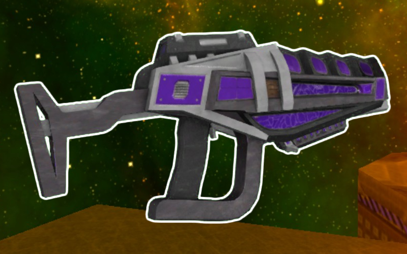

* TOC
{:toc}
## Electro Zapper

[Click here to return to the main page.](Weapons-Guide)

| Utility | Power | Difficulty |
|------------------|------------|------------|
| Adaptable (☆☆☆) | Low (☆☆) | Easy (☆☆) |

### Description

The Zapper, an almost truly generalist weapon that excels in long-range fights, but whose power is respectable at medium and short ranges as well, and yet its damage output is still below average. At first glance, it functions similarly to how the SMG does, but has a much heavier weight, so chasing people is not necessarily what you're going to be doing a lot of with this. Absolutely perfect for picking off weakened targets, this thing induces about the same fear as seeing a Flamethrower user charging at you. Interestingly, the Zapper can hold a fuckton of ammo clips, so while running out of it with this weapon is possible, it's not something that will happen a lot, and you can be as wasteful with ammunition as you want.

### Primary

Primary fire is the only hitscan attack in the game, discounting your alt-fire (technically, it's a projectile with hitscan properties, but this is not the place to talk about that). This already makes the primary ridiculously strong, as grazing an opponent with a few shots is a trivial endeavor, and this weapon is perfectly accurate. It fires about as fast as the SMG, but deals much less damage. The thing is that the Zapper's headshot damage is subpar, but its torso and limb damage falls off only slightly from that, which makes using it at longer ranges pleasant. You do not have to score headshots to deal decent damage. It performs well at medium and short ranges, too, but naturally you cannot expect it to be better than weapons completely dedicated to their effective ranges. Aside from these nuances, there is not much to say - it really is just a hitscan projectile.

### Secondary

The alt-fire is more interesting - charging it fires a huge burst of hitscan rays in a wide cone in front of you, more pronounced with higher charge. If any of these rays hit, they will shock the enemy, making gaining momentum a lot harder and dealing damage over time, and they also stick to the map's geometry for a fraction of a second, so enemies may "step" into the blots left over by your rays and get stunned. It is only effective at short ranges - beyond that, the weapon completely refuses to hit. Its damage is not that great compared to something like the Shotgun (though it's possible to kill with it, and it's not a bad idea against weakened opponents), but the stun utility is very useful - it will make hitting that enemy easier, or perhaps help you get away from them. Even better, you can easily apply stun to multiple people in a crowd, provided they are clustered enough.

### Tips

Thanks to the way the Zapper works, you can pretty easily play around any range you want and kill people indiscriminately, but it fulfills a very particular long-range rapid-fire weapon niche than no other weapon does in the game, and it's usually best to stick to that when possible, since you are disadvantaged when trying to run away. Sightlines are your best friend, just like with the Laser Rifle. Put the fear of God in people.

### Counterplay

The Zapper is a hellspawn of a weapon that has little weakness, but also no particular strength, but ALSO a deviously long range, which is where its main power comes from. It primarily loses effectiveness by having to face other weapons at their preferred ranges, so make your life easier instead of enduring stray shots from far away by getting as close as you need to (Laser Rifle users may want to take the opposite advice and get as far away as they can). It does not get the luxury of choosing its spacing nearly as easily as other weapons due to its weight. There are other very logical conclusions that can be drawn from the way it functions - do not get up too close unless you can kill its user easily, do not stay in the open so you cannot be picked off, and do not hang in the air for too long, since this gun's killzone is its player's field of vision. But other than that, there is not much to suggest that would not be an applicable strategy for everyone else.

### Strengths & Weaknesses

**Strong against:**

| Weapon | Explanation |
| :----: | ----------- |
|  | What the Plasma Gun's primary does, you do better at any range. The alt-fire, while it can catch you off-guard, is not something that you usually need to worry about, since you can stay out of range. And with that sort of range game, you can reliably secure a victory against a Plasma user. |
|  | With the shortest reach out of all the weapons you can choose, any range is desirable for you to approach the Sword user, and if they get up close, you can just stun them with the alt-fire and fucking kill them. You shouldn't underestimate them, however - that movement speed they got could get you killed if you're not careful. |

**Weak against:**

| Weapon | Explanation |
| :----: | ----------- |
|  | The Shotgun will split you in half. You can stay away from it and you have the upper hand when picking it off from far away, but when it gets to YOU, that's where the problems start. Unlike the SMG, you do not really have that much leeway in your escape attempts thanks to the gun's weight, and it might be too late when they get close enough. Bonus points, since the Shotgun doesn't need to get that close to you to deal decent damage, and the flak alt-fire can be about as annoying as you are to everyone else. |
