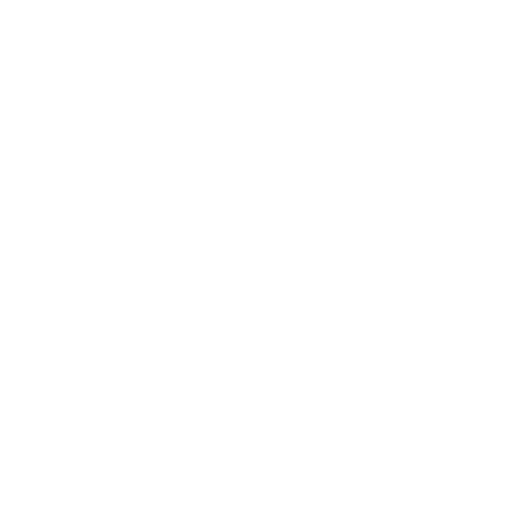

* TOC
{:toc}
*NOTE: This guide is up-to-date with version 2.0.9-9 of Red Eclipse.*

In most games, all players are equipped with a pistol and two loadout weapons that can be chosen in the Player Setup menu. Furthermore, explosive weapons can be collected in the arena, such as grenades and mines, to bolster their offensive abilities.

Click on one of these weapons to read more about them in detail, or continue onwards for more general information:

| | | | |
|:-------:|:-------:|:-------:|:-------:|
| **Sidearm Pistol** | **Energy Sword** | **Super Shotgun** | **Submachine Gun** |
|  |  |  |  |
| **Flame Thrower** | **Plasma Inductor** | **Electro Zapper** | **Laser Rifle** |
|  |  |  |  |
| **Corrosion Cannon** | **Frag Grenade** | **Shock Mine** | **Rocket Launcher** |
|  |  |  |  |

These weapons have been given ratings in different categories so that you can judge certain traits that a weapon has.
- *Utility ratings* determine how versatile a weapon is in regards to its predominant use strategy. This can extend to more creative ways of using the weapon, or any additional benefits it may provide. A weapon with limited utility isn't bad - it will mostly do one thing it's intended to do.
- *Power ratings* determine how well this thing kills compared to other guns. While all weapons are strong in their own right in RE, some are slightly faster or more consistent at scoring kills than others (though this rating is still mainly influenced by damage). Therefore, keep in mind that a "low" power weapon does not necessarily mean the gun is not viable for use, it probably just requires a certain strategy.
- *Difficulty ratings* determine how easy it is to use the weapon. This includes techs involved with the weapon, how easy it is to hit something and anything that may contribute to it being hard to use.

Please note that these ratings do not accurately define the weapons' traits. They should mostly be understood as a quick measure of their most prominent qualities.

Also, do note that unless otherwise stated, a weapon being "strong" or "weak" against another is not a hard counter. The only real hard counter in this game is the *Energy Sword v. Flame Thrower* match up, and even that is dependent on either user's skill sometimes.   

### Quick weapon difficulty guide

From easiest to hardest, here are the weapons you can master in Red Eclipse:

| Weapon | Explanation |
|-|-|
|  | It takes a person with broken fingers to not use this weapon well. Wouldn't use its alt fire in most cases, though. |
|  | A weapon that you set down and forget about, it's this easy to use it. You can also throw it at people with some skill and end up murdering them in the funniest way possible. |
|  | Easy to spam, alt fire is very versatile, melts crowds like butter. Only problem is if your aim is so bad that you can't even hit a single flame, but that's a rarity even for new players. Regardless, it's really strong. |
|  | Easy to hit things from medium to short distances 'cuz projectiles are huge. Even misses deal graze damage, and its body damage is amazing. Alt fire takes time getting used to, but it can be used for many different things. |
|  | Reliable and deletes your opposition in a timely fashion. Your aim needs to be on point, but you do not need to worry about slow projectiles. It's pretty good for killing people that run away. Alt fire also stuns people, which is crazy! |
|  | Astounding damage from up close and instakills on headshots, sometimes even well-placed bodyshots. Alt fire is not easy to use, but helps with annoyances people when you have the shells to spend. May wanna brush up on ammo conservation and weapon switching skills for this big boy. |
|  | You can spam it, but it's not nearly as effective as the Flamer sometimes. A powerful weapon if used right, but due to its really short range, it may be hard to land a hit at all, and other short-range weapons *(Shotgun, Flamer, Corroder primary)* may screw you over. |
|  | Extremely powerful primary, but you need to consistently score headshots (or at least bodyshots) to kill someone. Secondary requires practice to use well, but can instakill people with some luck and an understanding of its workings. |
|  | Strong, with the highest DPS in the game (though this may have changed since the Shotgun's firerate change), but hard to feel out and score hits with. Alt fire is an okay last resort, but it's currently broken. |
|  | It's a sniper rifle. Needless to say, aim well with this thing, because missing shots will land you in a grave. |
|  | Requires a surprising amount of skill to use. Primary is short-ranged and hard to aim, but devastating and can lob. Secondary also lobs, but can instakill with headshots, and lets you place minefields on demand. Hardcore. |
|  | Tricky to use and the throwing arc is influenced by your inertia. You need to learn how to cook them well. Primary and alt fire may not seem too different, but bouncing or sticking grenades to a surface can achieve vastly different results. Overall fantastic, in practice the hardest weapon to use in this game. |

### Weapon weight

*NOTE: This specific part of the guide is NOT up-to-date with Red Eclipse 2.0.9-9. Please wait patiently.*

Each weapon has a different weight. In general, the heavier the weapon, the more powerful it is, but you will move slower than other players who use lighter weapons. Here are some info you want to know:
- Claw, Pistol and Sword: 0 units
- Shotgun: 5 units
- Submachine Gun: 3 units
- Plasma: 8 units
- Flamer: 6 units
- Zapper: 10 units
- Rifle: 12 units
- Grenade: 3 units
- Mine: 3 units
- Rocket Launcher: 15 units

### Status effects

Some weapons induce status ailments that inflict some damage over time and last for about five seconds. Useful to delay enemy health recovery. Multiple effects can be stacked. See the [main article](Status-Effects) for more.

### Anatomy

The player model is split into 3 parts, which determine how much damage is applied to them: head, torso and legs. All damage values determined by the weapon specific variables apply to the head. The torso and legs then take a variable percentage of that damage value, sometimes higher (like the Flamer's secondary fire or the Zapper's primary), but usually smaller than the head damage.

### Weapon variables

When playing offline or as a server ~~[operator](Privileges)~~, almost all aspects of game rules can be tuned and modified using the ~~[console](Console)~~ to control thousands of ~~[variables](Variables)~~. This includes a large ~~[array of variables](Variables-and-Commands)~~ for each weapon that give you deep control of their characteristics.

#### Weapon IDs

Weapon numbers or IDs are used for certain variables, for instance when defining the weapon for the Instagib game mutator, or when referring to some particle presets. The following table gives a compact overview of the available weapons slots and their IDs. For some variables, such as fragweap, an additional ID refers to the secondary fire mode.

#### Frag and flak vars

Variables related to flak or fragmentation give a plethora of options for creating weapon mods. However, the use of these variables can be rather confusing.

- In essence, when the projectile of a weapon is destroyed (impact or expired lifetime), new flak projectiles can be created (fragmentation).
- The corresponding *fragweap* variable defines which type of projectiles are created according to a [weapon ID](#weapon-ids) (none for -1).
- Further *frag* variables define the number and dynamics of these projectiles.
- A large array of *flak* variables has defaults inherited from their base weapon variables.
- These *flak* variables define many properties of flak projectiles. The variable names refer to the type of flak created (the ID used for *fragweap*), not the type of parent projectile.
