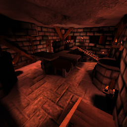

* TOC
{:toc}

## Information

|                            |                                          |
|----------------------------|------------------------------------------|
| **Name**                   | Blink                                    |
| **Author**                 | Jonathan 'W!CK3D' Roels                  |
| **Filename**               | blink                                    |
| **Release Date**           | ????-??-??                               |
| **Removed in**             | 1.4.0                                    |
| **Size**                   | Medium (4-8)                             |
| **Complexity**             | Advanced                                 |
| **Theme**                  | N/A                                      |
| **Environmental Features** | N/A                                      |
| **Day/Night**              | ✔/✖                                      |
| **Lights**                 | 59                                       |
| **Entities**               | 257                                      |
| **Vertices**               | ~52 000                                  |
| **Triangles**              | ~40 000                                  |
| **Recommend Modes**        | Deathmatch, Team Deathmatch              |

## Review

This map is no longer included with the game. (Removed in 1.4.0)

## Spawn Register

| Weapon/Item                                                         | Count |
|---------------------------------------------------------------------|:-----:|
|  **Sword**     |   1   |
|  **Shotgun** |   4   |
|  **SMG**         |   4   |
|  **Flamer**   |   3   |
|  **Plasma**   |   2   |
|  **Zapper**   |   0   |
|  **Rifle**     |   2   |
|  **Grenade** |  16   |
|  **Mine**       |   0   |
|  **Rocket**   |   2   |
