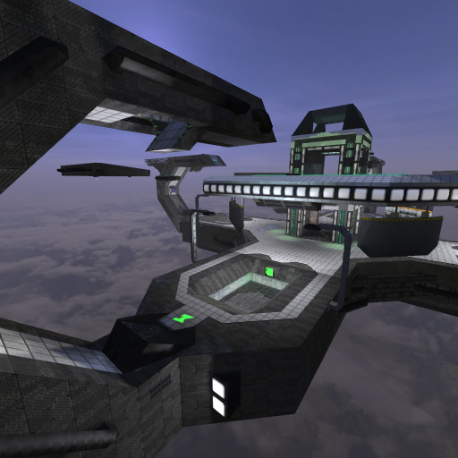

* TOC
{:toc}

## Information

|                            |                                                          |
|----------------------------|----------------------------------------------------------|
| **Name**                   | 4plex                                                    |
| **Author**                 | D.a.M.i.E.n. and Korsi                                   |
| **Filename**               | fourplex                                                 |
| **Release Date**           | ????-??-??                                               |
| **Removed in**             | 1.5.0                                                    |
| **Size**                   | Medium (6-8)                                             |
| **Complexity**             | Intermediate                                             |
| **Theme**                  | Futuristic                                               |
| **Environmental Features** | N/A                                                      |
| **Day/Night**              | ✔/✖                                                      |
| **Lights**                 | 176                                                      |
| **Entities**               | 459                                                      |
| **Vertices**               | ~112 000                                                 |
| **Triangles**              | ~70 000                                                  |
| **Recommend Modes**        | Team/Multi Deathmatch, Capture the Flag, Defend the Flag |

## Review

Gloriously symmetrical and ridiculously grey, 4plex by Damien is a space map for the ages. Launch toward the chaotic center area using the pushers at each of the lower bases, and grab that rocket to punish those without a flying license.

This map is no longer included with the game. (Removed in 1.5.0)

## Notes & Strategies

- This map has an abundance of powerful pushers; use their force wisely, to propel you in the right direction.
- The rocket spawns in the middle of the map, on the top platform.

## Spawn Register

| Weapon/Item                                                         | Count |
|---------------------------------------------------------------------|:-----:|
|  **Sword**     |   4   |
|  **Shotgun** |   4   |
|  **SMG**         |   4   |
|  **Flamer**   |   1   |
|  **Plasma**   |   4   |
|  **Zapper**   |   0   |
|  **Rifle**     |   4   |
|  **Grenade** |   4   |
|  **Mine**       |   4   |
|  **Rocket**   |   1   |
