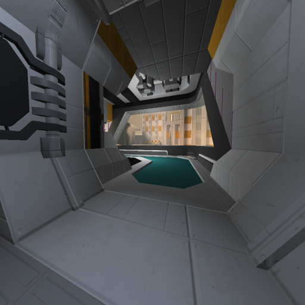

* TOC
{:toc}

## Information

|                            |                                      |
|----------------------------|--------------------------------------|
| **Name**                   | Auster                               |
| **Author**                 | Alex "molexted" Foster               |
| **Filename**               | auster                               |
| **Release Date**           | 2019-07-11                           |
| **Introduced in**          | 1.9.9                                |
| **Size**                   | Small (2-4)                          |
| **Complexity**             | Simple                               |
| **Theme**                  | Desert (on exterior)                 |
| **Environmental Features** | None                                 |
| **Day/Night**              | ✔/✔                                  |
| **Lights**                 | 58                                   |
| **Entities**               | 133                                  |
| **Vertices**               | 47k                                  |
| **Triangles**              | 62k                                  |
| **Vslots**                 | 539                                  |
| **Recommend Modes**        | Duel                                 |

## Review
This is the map formerly known by its assigned layout name, ffs33.
Small duel-centric map with three levels and no teleporters or jumpers. Sunset lighting provided for alt mode and broad daylight in normal mode.
This is the first complete map done with phillipk's normal maps over flat diffuse textures; the skeletons of phillipk's textures are visible but muted in this map.

## Notes & Strategies

- There is no rocket on this level, so don't bother trying to find one.
- There are no mines on this level.
- There are plentiful grenades (5) so don't be too prudish about using them.
- Plasma is the most limited ammo on this map (all other main weapons have two spawns vs. plasma with one) and is in a vulnerable position on the first floor.
- Weapons have color-coded spawn platforms and accented lighting surrounding them to assist in identification.
- Flamer users are susceptible to running out of ammo on the bottom floor; shotgun users are likewise susceptible to ammo depletion on the top floor.

## Spawn Register

| Weapon/Item                                                         | Count |
|---------------------------------------------------------------------|:-----:|
|  **Sword**     |   1   |
|  **Shotgun** |   2   |
|  **SMG**         |   2   |
|  **Flamer**   |   2   |
|  **Plasma**   |   1   |
|  **Zapper**   |   2   |
|  **Rifle**     |   2   |
|  **Grenade** |   5   |
|  **Mine**       |   0   |
|  **Rocket**   |   0   |
